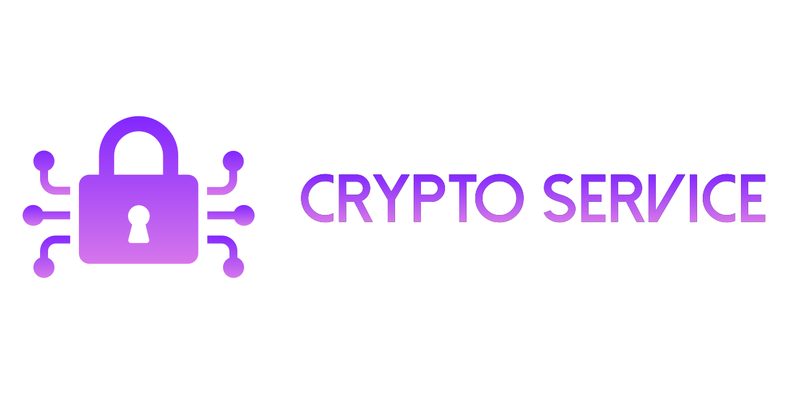

<!-- SPDX-License-Identifier: MIT OR Apache-2.0 -->

<p align="center">
  
</p>

<h1 align="center">Crypto Service Suite</h1>

<p align="center">
  <em>A comprehensive TypeScript cryptography toolkit — 50+ algorithms, post-quantum ready, full-stack integration.</em>
</p>

<p align="center">
  <a href="https://github.com/sebastienrousseau/crypto-service/actions"></a>
  <a href="https://www.npmjs.com/package/@sebastienrousseau/crypto-service"></a>
  <a href="https://coveralls.io/github/sebastienrousseau/crypto-service?branch=main"></a>
  <a href="https://opensource.org/licenses/MIT"></a>
  <a href="https://nodejs.org"></a>
</p>

---

## Contents

### Getting started

- [Install](#install)
- [Quick Start](#quick-start)

### The Crypto Service ecosystem

- [Packages overview](#the-crypto-service-ecosystem-1)

### Library reference

- [Why this approach?](#why-this-approach)
- [Capabilities in 0.0.3](#capabilities-in-003)
- [Ecosystem comparison](#ecosystem-comparison)
- [Benchmarks](#benchmarks)
- [Features](#features)
- [Examples](#examples)

### Operational

- [One-minute migration from legacy tools](#one-minute-migration-from-legacy-tools)
- [When not to use Crypto Service](#when-not-to-use-crypto-service)
- [Development](#development)
- [Security](#security)
- [Documentation](#documentation)
- [License](#license)

---

## Install

Crypto Service is distributed as a family of scoped npm packages. Install only what
you need, or clone the entire monorepo for full-stack development.

| Method                 | Command / Steps                                                           |
| :--------------------- | :------------------------------------------------------------------------ |
| **pnpm** (recommended) | `pnpm add @sebastienrousseau/crypto-lib`                                  |
| **npm**                | `npm install @sebastienrousseau/crypto-lib`                               |
| **yarn**               | `yarn add @sebastienrousseau/crypto-lib`                                  |
| **From source**        | See [building from source](#building-from-source) below                   |
| **Docker**             | `docker run -p 3000:3000 ghcr.io/sebastienrousseau/crypto-service:latest` |

### Individual packages

Install only the packages your application requires:

```bash
# Core cryptographic library (required for all operations)
pnpm add @sebastienrousseau/crypto-lib

# REST API server
pnpm add @sebastienrousseau/crypto-server

# TypeScript SDK client for the REST API
pnpm add @sebastienrousseau/crypto-sdk

# CLI tool (install globally)
pnpm add -g @sebastienrousseau/crypto-cli

# Framework integrations
pnpm add @sebastienrousseau/crypto-react       # React hooks
pnpm add @sebastienrousseau/crypto-vue         # Vue 3 composables
pnpm add @sebastienrousseau/crypto-middleware  # Express/Fastify middleware

# ORM adapters
pnpm add @sebastienrousseau/crypto-prisma      # Prisma field encryption
pnpm add @sebastienrousseau/crypto-typeorm     # TypeORM column encryption

# Infrastructure
pnpm add @sebastienrousseau/crypto-edge        # Edge/serverless adapter
pnpm add @sebastienrousseau/crypto-kms         # Cloud KMS integration
pnpm add @sebastienrousseau/crypto-wasm        # WASM accelerator

# Testing utilities
pnpm add -D @sebastienrousseau/crypto-testing  # Deterministic test fixtures
```

### Building from source

```bash
git clone https://github.com/sebastienrousseau/crypto-service.git
cd crypto-service
pnpm install
pnpm build
```

### Requirements

| Dependency | Minimum version | Tested versions |
| :--------- | :-------------- | :-------------- |
| Node.js    | 22.0.0          | 22.x, 24.x      |
| pnpm       | 9.0.0           | 9.15.x          |
| TypeScript | 5.4.0           | 5.7.x           |

> **Note:** Crypto Service has zero native dependencies. No C compiler, Python, or
> `node-gyp` is required. The library runs on any platform that supports Node.js 22+.

<p align="right"><a href="#contents">Back to top</a></p>

---

## Quick Start

### Symmetric authenticated encryption

```typescript
import { secretbox } from "@sebastienrousseau/crypto-lib";

// Generate a random 256-bit key
const key = crypto.getRandomValues(new Uint8Array(32));

// Encrypt — nonce is generated automatically and prepended to the ciphertext
const plaintext = new TextEncoder().encode("Hello, post-quantum world!");
const sealed = secretbox.seal(plaintext, key);

// Decrypt — extracts the nonce, verifies the authentication tag, returns plaintext
const opened = secretbox.open(sealed, key);
const message = new TextDecoder().decode(opened);

console.log(message); // "Hello, post-quantum world!"
```

### Digital signatures

```typescript
import { sign, verify, keygen } from "@sebastienrousseau/crypto-lib";

// Generate an Ed25519 key pair
const { publicKey, secretKey } = keygen("ed25519");

// Sign a message
const message = new TextEncoder().encode("Sign this document");
const signature = sign(message, secretKey, "ed25519");

// Verify the signature
const valid = verify(message, signature, publicKey, "ed25519");
console.log(valid); // true
```

### Post-quantum key encapsulation

```typescript
import { pqKem } from "@sebastienrousseau/crypto-lib";

// Generate ML-KEM-768 key pair
const { publicKey, secretKey } = pqKem.keygen("ml-kem-768");

// Encapsulate — produces a shared secret and ciphertext
const { sharedSecret, ciphertext } = pqKem.encapsulate(publicKey, "ml-kem-768");

// Decapsulate — recovers the same shared secret
const recovered = pqKem.decapsulate(ciphertext, secretKey, "ml-kem-768");

// sharedSecret and recovered are identical 32-byte keys
```

### Password-based encryption

```typescript
import { passwordEncrypt } from "@sebastienrousseau/crypto-lib";

// Encrypt with Argon2id key derivation + XChaCha20-Poly1305
const ciphertext = await passwordEncrypt.seal(
  "sensitive data",
  "user-password",
);

// Decrypt — Argon2 parameters are stored in the ciphertext header
const plaintext = await passwordEncrypt.open(ciphertext, "user-password");
```

### Using the REST API

```typescript
import { CryptoSDK } from "@sebastienrousseau/crypto-sdk";

const client = new CryptoSDK({ baseUrl: "http://localhost:3000" });

// Encrypt via the v2 API
const { ciphertext } = await client.encrypt({
  algorithm: "xchacha20-poly1305",
  plaintext: "Hello from the SDK",
  key: "0a1b2c3d...", // hex-encoded 256-bit key
});

// Hash
const { digest } = await client.hash({
  algorithm: "blake3",
  data: "Hash this string",
});
```

### Using the CLI

```bash
# Generate an Ed25519 key pair
crypto-cli keygen --algorithm ed25519 --output keys/

# Encrypt a file
crypto-cli encrypt --input secret.txt --key keys/public.key --output secret.enc

# Sign a message
crypto-cli sign --input document.pdf --key keys/private.key --output document.sig

# Verify a signature
crypto-cli verify --input document.pdf --signature document.sig --key keys/public.key

# Hash with BLAKE3
crypto-cli hash --algorithm blake3 --input largefile.bin

# Post-quantum key generation
crypto-cli keygen --algorithm ml-kem-768 --output pq-keys/

# JSON output for scripting
crypto-cli hash --algorithm sha256 --input data.bin --json | jq '.digest'
```

### React hook usage

```tsx
import { useEncrypt, useDecrypt } from "@sebastienrousseau/crypto-react";

function SecureForm() {
  const { encrypt, ciphertext, loading: encrypting } = useEncrypt();
  const { decrypt, plaintext, loading: decrypting } = useDecrypt();

  const handleEncrypt = async () => {
    await encrypt({
      algorithm: "xchacha20-poly1305",
      plaintext: "Sensitive user data",
      key: userKey,
    });
  };

  return (
    <div>
      <button onClick={handleEncrypt} disabled={encrypting}>
        {encrypting ? "Encrypting..." : "Encrypt"}
      </button>
      {ciphertext && <pre>{ciphertext}</pre>}
    </div>
  );
}
```

### Prisma transparent encryption

```typescript
import { withEncryption } from "@sebastienrousseau/crypto-prisma";
import { PrismaClient } from "@prisma/client";

const prisma = new PrismaClient().$extends(
  withEncryption({
    encryptedFields: {
      User: ["email", "phone", "ssn"],
      Payment: ["cardNumber", "cvv"],
    },
    key: process.env.ENCRYPTION_KEY!,
    algorithm: "aes-256-gcm",
  }),
);

// Writes are encrypted transparently
await prisma.user.create({
  data: { email: "user@example.com", phone: "+1234567890", name: "Alice" },
});

// Reads are decrypted transparently
const user = await prisma.user.findUnique({ where: { id: 1 } });
console.log(user.email); // "user@example.com" (decrypted)
```

### Edge runtime (Cloudflare Workers)

```typescript
import { createEdgeCrypto } from "@sebastienrousseau/crypto-edge";

export default {
  async fetch(request: Request): Promise<Response> {
    const crypto = createEdgeCrypto();

    // All operations work identically to Node.js
    const key = crypto.generateKey("xchacha20-poly1305");
    const encrypted = crypto.encrypt("Hello from the edge", key);

    return new Response(JSON.stringify({ encrypted }), {
      headers: { "Content-Type": "application/json" },
    });
  },
};
```

### KMS envelope encryption

```typescript
import { createKmsProvider } from "@sebastienrousseau/crypto-kms";

const kms = createKmsProvider({
  provider: "aws",
  region: "us-east-1",
  keyId: "arn:aws:kms:us-east-1:123456789:key/abcd-1234",
});

// Envelope encryption: KMS encrypts a data key, data key encrypts your data
const { ciphertext, encryptedDataKey } = await kms.envelopeEncrypt(
  Buffer.from("sensitive data"),
);

// Decrypt: KMS decrypts the data key, data key decrypts your data
const plaintext = await kms.envelopeDecrypt(ciphertext, encryptedDataKey);
```

<p align="right"><a href="#contents">Back to top</a></p>

---

## The Crypto Service ecosystem

The monorepo contains 14 packages. Every package achieves 100% test coverage
(statements, branches, and functions) and full TypeDoc documentation with zero
warnings.

| Package                                           | npm                                    | Description                                                                                                   |
| :------------------------------------------------ | :------------------------------------- | :------------------------------------------------------------------------------------------------------------ |
| [`crypto-lib`](packages/crypto-lib)               | `@sebastienrousseau/crypto-lib`        | Core cryptographic library — 50+ algorithms, @noble/\* primitives, PQC, streaming, protocols, high-level APIs |
| [`crypto-server`](packages/crypto-server)         | `@sebastienrousseau/crypto-server`     | Fastify REST API server with versioned endpoints (v1 legacy PGP, v2 modern), telemetry, health probes         |
| [`crypto-api`](packages/crypto-api)               | `@sebastienrousseau/crypto-api`        | REST API utilities, OpenAPI schema generation, and documentation tooling                                      |
| [`crypto-cli`](packages/crypto-cli)               | `@sebastienrousseau/crypto-cli`        | Interactive and scriptable CLI for key generation, encryption, signing, hashing, and PQC operations           |
| [`crypto-sdk`](packages/crypto-sdk)               | `@sebastienrousseau/crypto-sdk`        | Type-safe TypeScript client for the v2 REST API — zero dependencies, fetch-based, tree-shakeable              |
| [`crypto-edge`](packages/crypto-edge)             | `@sebastienrousseau/crypto-edge`       | Edge/serverless adapter with runtime detection — Cloudflare Workers, Vercel Edge, Deno, Bun, browsers         |
| [`crypto-kms`](packages/crypto-kms)               | `@sebastienrousseau/crypto-kms`        | Enterprise key management — AWS KMS, Google Cloud KMS, Azure Key Vault, HashiCorp Vault integration           |
| [`crypto-middleware`](packages/crypto-middleware) | `@sebastienrousseau/crypto-middleware` | Express/Fastify middleware — request decryption, response encryption, signature verification, JWT validation  |
| [`crypto-prisma`](packages/crypto-prisma)         | `@sebastienrousseau/crypto-prisma`     | Prisma ORM integration — transparent field-level encryption via client extensions                             |
| [`crypto-typeorm`](packages/crypto-typeorm)       | `@sebastienrousseau/crypto-typeorm`    | TypeORM column-level encryption via `@EncryptedColumn()` decorator                                            |
| [`crypto-react`](packages/crypto-react)           | `@sebastienrousseau/crypto-react`      | React hooks — useEncrypt, useDecrypt, useSign, useVerify, useHash, useKeyGen                                  |
| [`crypto-vue`](packages/crypto-vue)               | `@sebastienrousseau/crypto-vue`        | Vue 3 composables mirroring the React hook API for client-side cryptography                                   |
| [`crypto-testing`](packages/crypto-testing)       | `@sebastienrousseau/crypto-testing`    | Deterministic keys, fast mocks, known-answer-test vectors, and fixtures for CI/CD                             |
| [`crypto-wasm`](packages/crypto-wasm)             | `@sebastienrousseau/crypto-wasm`       | WebAssembly performance accelerator with automatic JS fallback when WASM is unavailable                       |

### Package dependency graph

```
crypto-lib (core, no internal deps)
├── crypto-server     (depends on crypto-lib)
│   └── crypto-sdk    (depends on crypto-server types)
├── crypto-cli        (depends on crypto-lib)
├── crypto-edge       (depends on crypto-lib)
├── crypto-kms        (depends on crypto-lib)
├── crypto-middleware (depends on crypto-lib)
├── crypto-prisma     (depends on crypto-lib)
├── crypto-typeorm    (depends on crypto-lib)
├── crypto-react      (depends on crypto-lib)
├── crypto-vue        (depends on crypto-lib)
├── crypto-wasm       (depends on crypto-lib)
├── crypto-testing    (depends on crypto-lib)
└── crypto-api        (depends on crypto-lib)
```

### Test coverage summary

| Package           | Statements | Branches  | Functions |     Tests |
| :---------------- | :--------: | :-------: | :-------: | --------: |
| crypto-lib        |    100%    |  99.88%   |   100%    |       617 |
| crypto-server     |    100%    |   100%    |   100%    |       271 |
| crypto-sdk        |    100%    |   100%    |   100%    |        60 |
| crypto-cli        |    100%    |   100%    |   100%    |        89 |
| crypto-api        |    100%    |   100%    |   100%    |       116 |
| crypto-edge       |    100%    |   100%    |   100%    |       113 |
| crypto-kms        |    100%    |   100%    |   100%    |       191 |
| crypto-middleware |    100%    |   100%    |   100%    |       101 |
| crypto-prisma     |    100%    |   100%    |   100%    |        74 |
| crypto-react      |    100%    |   100%    |   100%    |        81 |
| crypto-testing    |    100%    |   100%    |   100%    |       118 |
| crypto-typeorm    |    100%    |   100%    |   100%    |        51 |
| crypto-vue        |    100%    |   100%    |   100%    |       104 |
| crypto-wasm       |    100%    |   100%    |   100%    |        37 |
| **Total**         |  **100%**  | **~100%** | **100%**  | **2,235** |

> The single 99.88% branch in crypto-lib is an environment variable fallback line
> with an explicit `c8 ignore` comment — it cannot be reached in the test
> environment by design.

<p align="right"><a href="#contents">Back to top</a></p>

---

## One-minute migration from legacy tools

### From crypto-js

```diff
- import CryptoJS from 'crypto-js';
- const ct = CryptoJS.AES.encrypt('secret', 'password').toString();
- const pt = CryptoJS.AES.decrypt(ct, 'password').toString(CryptoJS.enc.Utf8);
+ import { passwordEncrypt } from '@sebastienrousseau/crypto-lib';
+ const ct = await passwordEncrypt.seal('secret', 'password');
+ const pt = await passwordEncrypt.open(ct, 'password');
```

**Why switch:**

- crypto-js uses AES-CBC without authentication, making it vulnerable to padding oracle attacks.
- Key derivation uses a single MD5 iteration (OpenSSL EVP_BytesToKey), crackable instantly.
- No TypeScript types; no post-quantum support; unmaintained since 2021.
- Crypto Service uses Argon2id (memory-hard) for key derivation and XChaCha20-Poly1305 (AEAD).

### From node-forge

```diff
- import forge from 'node-forge';
- const md = forge.md.sha256.create();
- md.update('hello');
- const hex = md.digest().toHex();
+ import { hash } from '@sebastienrousseau/crypto-lib';
+ const hex = hash('sha256', 'hello');
```

**Why switch:**

- node-forge bundles a pure-JS RSA that is vulnerable to timing attacks.
- No support for modern curves (Ed25519, X25519), no Argon2, no post-quantum algorithms.
- Large bundle (>500 KB minified) with many unused legacy formats (ASN.1 parser, PKCS#12).
- Crypto Service provides a minimal, focused API with tree-shaking support.

### From sjcl

```diff
- import sjcl from 'sjcl';
- const ct = sjcl.encrypt('password', 'secret');
- const pt = sjcl.decrypt('password', ct);
+ import { passwordEncrypt } from '@sebastienrousseau/crypto-lib';
+ const ct = await passwordEncrypt.seal('secret', 'password');
+ const pt = await passwordEncrypt.open(ct, 'password');
```

**Why switch:**

- sjcl uses PBKDF2 with only 1000 iterations — crackable in seconds on modern GPUs.
- No Argon2 support; no authenticated encryption by default; no streaming API.
- Last updated in 2016; no TypeScript types; no post-quantum algorithms.
- Crypto Service defaults to Argon2id with configurable memory/time cost.

### From tweetnacl

```diff
- import nacl from 'tweetnacl';
- const key = nacl.randomBytes(32);
- const nonce = nacl.randomBytes(24);
- const ct = nacl.secretbox(msg, nonce, key);
- const pt = nacl.secretbox.open(ct, nonce, key);
+ import { secretbox } from '@sebastienrousseau/crypto-lib';
+ const key = crypto.getRandomValues(new Uint8Array(32));
+ const ct = secretbox.seal(msg, key);         // nonce auto-generated
+ const pt = secretbox.open(ct, key);          // nonce extracted automatically
```

**Why switch:**

- tweetnacl requires manual nonce management — a common source of nonce reuse bugs.
- Only supports XSalsa20 (no AES, no ChaCha20-Poly1305 IETF, no GCM-SIV).
- No key derivation, no streaming, no post-quantum, no key serialization.
- Crypto Service auto-generates nonces and prepends them to ciphertext.

### From Web Crypto API (native)

```diff
- const key = await crypto.subtle.generateKey(
-   { name: 'AES-GCM', length: 256 }, true, ['encrypt', 'decrypt']
- );
- const iv = crypto.getRandomValues(new Uint8Array(12));
- const ct = await crypto.subtle.encrypt({ name: 'AES-GCM', iv }, key, data);
- // Must manually store iv alongside ciphertext
- // No built-in key derivation from password
- // No post-quantum, no streaming, no key wrapping helper
+ import { secretbox } from '@sebastienrousseau/crypto-lib';
+ const key = crypto.getRandomValues(new Uint8Array(32));
+ const ct = secretbox.seal(data, key);   // iv handled automatically
+ const pt = secretbox.open(ct, key);
```

**Why switch:**

- Web Crypto API is low-level: you must manage IVs, handle ArrayBuffer conversions, remember algorithm names.
- No Argon2, no XChaCha20, no post-quantum, no streaming, no protocols.
- Crypto Service uses Web Crypto internally (via the WebCrypto bridge) for hardware acceleration while providing a safe high-level API.

<p align="right"><a href="#contents">Back to top</a></p>

---

## Why this approach?

Crypto Service is built on deliberate engineering decisions that prioritize
security, portability, and developer experience.

### Audited primitives

All modern cryptography is implemented by the [@noble](https://github.com/paulmillr)
family of libraries:

| Library             | Audit                                                                                        | Coverage                                           |
| :------------------ | :------------------------------------------------------------------------------------------- | :------------------------------------------------- |
| @noble/hashes       | [Trail of Bits (2022)](https://github.com/nickcath/audits/blob/main/noble-hashes-audit.pdf)  | SHA-2, SHA-3, BLAKE2/3, KMAC, Argon2               |
| @noble/curves       | [Trail of Bits (2023)](https://github.com/nickcath/audits/blob/main/noble-curves-audit.pdf)  | Ed25519, X25519, P-256, secp256k1, Ed448, X448     |
| @noble/ciphers      | [Trail of Bits (2024)](https://github.com/nickcath/audits/blob/main/noble-ciphers-audit.pdf) | AES-GCM, AES-GCM-SIV, ChaCha20-Poly1305, XChaCha20 |
| @noble/post-quantum | Community reviewed                                                                           | ML-KEM, ML-DSA, SLH-DSA                            |

### Post-quantum readiness

NIST finalized its post-quantum standards in 2024 (FIPS 203, 204, 205). Crypto
Service implements all three:

- **ML-KEM** (formerly Kyber) — Key encapsulation mechanism for key exchange.
- **ML-DSA** (formerly Dilithium) — Lattice-based digital signatures.
- **SLH-DSA** (formerly SPHINCS+) — Stateless hash-based signatures.

Hybrid key exchange modes (P-256+ML-KEM-768, X448+ML-KEM-1024) provide
transitional security: if the post-quantum algorithm is broken, the classical
component still protects the session.

### Zero unsafe dependencies

- No native addons (`node-gyp` is never invoked).
- No OpenSSL bindings (the library is pure TypeScript/JavaScript).
- Runs identically on Node.js, Deno, Bun, Cloudflare Workers, and browsers.
- No `eval()`, no `Function()`, no dynamic code generation.

### AEAD-only symmetric encryption

Every symmetric encryption function exposed by Crypto Service provides
authenticated encryption with associated data (AEAD):

- AES-256-GCM
- AES-256-GCM-SIV (nonce-misuse resistant)
- XChaCha20-Poly1305
- ChaCha20-Poly1305

Unauthenticated modes (CBC, CTR, ECB) are intentionally excluded from the public
API. This eliminates an entire class of vulnerabilities (padding oracles,
ciphertext malleability) by construction.

### Constant-time operations

All operations that compare secret material use timing-safe comparison:

- AEAD tag verification
- Password hash verification
- HMAC comparison
- Signature verification (final comparison step)

The `timingSafeEqual` utility is shared across all packages to prevent
inconsistent implementations.

### TypeScript-first design

- Full type coverage with zero `any` casts in the public API.
- Discriminated unions for algorithm selection (the compiler rejects invalid combinations).
- Key lengths enforced at the type level (e.g., `Uint8Array & { length: 32 }`).
- All packages export `.d.ts` type declarations.

### Misuse-resistant API

- Nonces are auto-generated and prepended to ciphertext (no nonce management required).
- Key lengths are validated at runtime with clear error messages.
- Deprecated APIs emit runtime warnings and HTTP deprecation headers.
- Unsafe operations (raw ECDH without KDF, etc.) require explicit opt-in.

### Monorepo cohesion

- All 14 packages share a single pnpm lockfile.
- Unified CI pipeline catches cross-package breaking changes before publish.
- Consistent code style (ESLint + Prettier) across every package.
- Single version for coordinated releases.

<p align="right"><a href="#contents">Back to top</a></p>

---

## Capabilities in 0.0.3

### Symmetric encryption

| Algorithm          | Key sizes | Nonce size | Tag size | Notes                                                    |
| :----------------- | :-------- | :--------- | :------- | :------------------------------------------------------- |
| AES-256-GCM        | 256-bit   | 96-bit     | 128-bit  | NIST standard, hardware-accelerated via WebCrypto bridge |
| AES-256-GCM-SIV    | 256-bit   | 96-bit     | 128-bit  | Nonce-misuse resistant (RFC 8452)                        |
| XChaCha20-Poly1305 | 256-bit   | 192-bit    | 128-bit  | Extended nonce, safe random generation                   |
| ChaCha20-Poly1305  | 256-bit   | 96-bit     | 128-bit  | IETF RFC 8439, TLS 1.3 cipher                            |

### Hash functions

| Algorithm | Output size          | Block size | Notes                                                     |
| :-------- | :------------------- | :--------- | :-------------------------------------------------------- |
| SHA-256   | 256-bit              | 512-bit    | FIPS 180-4, universal                                     |
| SHA-384   | 384-bit              | 1024-bit   | Truncated SHA-512                                         |
| SHA-512   | 512-bit              | 1024-bit   | FIPS 180-4                                                |
| SHA3-256  | 256-bit              | 1088-bit   | FIPS 202, sponge construction                             |
| SHA3-512  | 512-bit              | 576-bit    | FIPS 202                                                  |
| BLAKE2b   | 1–512 bit            | 1024-bit   | Keyed hashing, tree mode, faster than SHA-3               |
| BLAKE2s   | 1–256 bit            | 512-bit    | Optimized for 32-bit platforms                            |
| BLAKE3    | 256-bit (extendable) | 512-bit    | Parallel, extendable output, fastest general-purpose hash |
| KMAC-128  | Configurable         | 1344-bit   | NIST SP 800-185, customizable prefix                      |
| KMAC-256  | Configurable         | 1088-bit   | NIST SP 800-185, customizable prefix                      |

### Key derivation functions

| Algorithm     | Parameters                | Notes                                             |
| :------------ | :------------------------ | :------------------------------------------------ |
| Argon2id      | memory, time, parallelism | Memory-hard, recommended for passwords (RFC 9106) |
| Argon2i       | memory, time, parallelism | Side-channel resistant variant                    |
| Argon2d       | memory, time, parallelism | Fastest variant (no side-channel resistance)      |
| HKDF-SHA256   | salt, info, length        | RFC 5869, extract-then-expand                     |
| HKDF-SHA512   | salt, info, length        | RFC 5869, 512-bit PRK                             |
| PBKDF2-SHA256 | iterations, salt          | FIPS compliant, legacy compatibility              |
| PBKDF2-SHA512 | iterations, salt          | FIPS compliant, legacy compatibility              |

All Argon2 variants support PHC string format output for interoperable password
hash storage.

### Digital signatures

| Algorithm         | Type         | Security level | Key size | Signature size | Notes                                     |
| :---------------- | :----------- | :------------- | :------- | :------------- | :---------------------------------------- |
| Ed25519           | EdDSA        | 128-bit        | 32 B     | 64 B           | Default for new applications              |
| Ed448             | EdDSA        | 224-bit        | 57 B     | 114 B          | Higher security margin                    |
| ECDSA P-256       | ECDSA        | 128-bit        | 32 B     | 64 B           | NIST curve, deterministic (RFC 6979)      |
| ECDSA P-384       | ECDSA        | 192-bit        | 48 B     | 96 B           | NIST curve, deterministic (RFC 6979)      |
| Schnorr (BIP-340) | Schnorr      | 128-bit        | 32 B     | 64 B           | Bitcoin Taproot compatible                |
| ML-DSA-44         | Post-quantum | NIST Level 2   | 1,312 B  | 2,420 B        | FIPS 204 (Dilithium)                      |
| ML-DSA-65         | Post-quantum | NIST Level 3   | 1,952 B  | 3,293 B        | FIPS 204, recommended                     |
| ML-DSA-87         | Post-quantum | NIST Level 5   | 2,592 B  | 4,595 B        | FIPS 204, highest security                |
| SLH-DSA           | Post-quantum | Configurable   | Variable | Variable       | FIPS 205 (SPHINCS+), stateless hash-based |

### Key exchange and encapsulation

| Algorithm          | Type     | Security level | Public key | Ciphertext | Shared secret | Notes                     |
| :----------------- | :------- | :------------- | :--------- | :--------- | :------------ | :------------------------ |
| X25519             | ECDH     | 128-bit        | 32 B       | 32 B       | 32 B          | RFC 7748                  |
| X448               | ECDH     | 224-bit        | 56 B       | 56 B       | 56 B          | RFC 7748                  |
| ECDH P-256         | ECDH     | 128-bit        | 65 B       | 65 B       | 32 B          | NIST curve                |
| ECDH P-384         | ECDH     | 192-bit        | 97 B       | 97 B       | 48 B          | NIST curve                |
| ML-KEM-512         | KEM      | NIST Level 1   | 800 B      | 768 B      | 32 B          | FIPS 203                  |
| ML-KEM-768         | KEM      | NIST Level 3   | 1,184 B    | 1,088 B    | 32 B          | FIPS 203, recommended     |
| ML-KEM-1024        | KEM      | NIST Level 5   | 1,568 B    | 1,568 B    | 32 B          | FIPS 203                  |
| P-256 + ML-KEM-768 | Hybrid   | Level 3        | Combined   | Combined   | 32 B          | Transitional security     |
| X448 + ML-KEM-1024 | Hybrid   | Level 5        | Combined   | Combined   | 32 B          | Strongest hybrid          |
| HPKE               | KEM+AEAD | 128-bit        | 32 B       | Variable   | N/A           | RFC 9180, X25519+ChaCha20 |

### Message authentication codes

| Algorithm   | Key size           | Tag size     | Notes                                 |
| :---------- | :----------------- | :----------- | :------------------------------------ |
| HMAC-SHA256 | Any                | 256-bit      | RFC 2104, most common                 |
| HMAC-SHA512 | Any                | 512-bit      | RFC 2104                              |
| KMAC-128    | Any                | Configurable | NIST SP 800-185                       |
| KMAC-256    | Any                | Configurable | NIST SP 800-185                       |
| Poly1305    | 256-bit (one-time) | 128-bit      | Used internally by AEAD constructions |

### Protocols

| Protocol               | Description                          | Security properties                                    |
| :--------------------- | :----------------------------------- | :----------------------------------------------------- |
| PQXDH                  | Post-quantum extended Diffie-Hellman | Forward secrecy, post-compromise security, deniability |
| Double Ratchet         | Signal-style message encryption      | Per-message forward secrecy, out-of-order delivery     |
| PAKE (OPAQUE-like)     | Password-authenticated key exchange  | No password transmission, mutual authentication        |
| Threshold / Shamir SSS | (t,n) secret sharing                 | Feldman VSS commitments, verifiable shares             |

### High-level APIs

| API               | Cipher                        | Description                                  |
| :---------------- | :---------------------------- | :------------------------------------------- |
| `secretbox`       | XChaCha20-Poly1305            | Symmetric AEAD with auto-nonce               |
| `sealedbox`       | X25519 + XChaCha20-Poly1305   | Anonymous public-key encryption              |
| `passwordEncrypt` | Argon2id + XChaCha20-Poly1305 | Password-based encryption                    |
| `keyWrap`         | AES-256-KW                    | RFC 3394 key wrapping                        |
| `multiRecipient`  | X25519 + XChaCha20-Poly1305   | Encrypt once, decrypt by any of N recipients |

### Streaming

| API          | Description             | Use case                                          |
| :----------- | :---------------------- | :------------------------------------------------ |
| `streamHash` | Incremental hashing     | Hash files or streams without loading into memory |
| `streamAead` | Chunked AEAD encryption | Encrypt large files with automatic rekeying       |

### Acceleration

| Feature          | Speedup           | Description                              |
| :--------------- | :---------------- | :--------------------------------------- |
| WebCrypto bridge | 5-10x for AES/SHA | Transparent offload to `crypto.subtle`   |
| Worker pool      | Linear with cores | Multi-threaded batch operations          |
| WASM module      | 2-3x              | WebAssembly accelerator with JS fallback |

### Key management

| Feature     | Description                                           |
| :---------- | :---------------------------------------------------- |
| `keygen`    | Unified key pair generation for all algorithms        |
| `serialize` | Import/export: JWK, PEM, raw, PKCS#8, SPKI            |
| `keyring`   | In-memory secure key storage with rotation and expiry |

<p align="right"><a href="#contents">Back to top</a></p>

---

## Ecosystem comparison

| Feature                      | Crypto Service | crypto-js  |  libsodium.js  | node-forge | Web Crypto |
| :--------------------------- | :------------: | :--------: | :------------: | :--------: | :--------: |
| **Language**                 |   TypeScript   | JavaScript | C (Emscripten) | JavaScript |   Native   |
| **TypeScript-first**         |      Yes       |     No     |    Partial     |     No     |  Partial   |
| **Bundle size (min+gz)**     |  45 KB (core)  |   35 KB    |     180 KB     |   520 KB   |    0 KB    |
| **Zero native deps**         |      Yes       |    Yes     |   No (WASM)    |    Yes     |    Yes     |
| **AEAD encryption**          |      Yes       |     No     |      Yes       |     No     |    Yes     |
| **AES-GCM-SIV**              |      Yes       |     No     |       No       |     No     |     No     |
| **XChaCha20-Poly1305**       |      Yes       |     No     |      Yes       |     No     |     No     |
| **Post-quantum (ML-KEM)**    |      Yes       |     No     |       No       |     No     |     No     |
| **Post-quantum (ML-DSA)**    |      Yes       |     No     |       No       |     No     |     No     |
| **Post-quantum (SLH-DSA)**   |      Yes       |     No     |       No       |     No     |     No     |
| **Hybrid key exchange**      |      Yes       |     No     |       No       |     No     |     No     |
| **HPKE (RFC 9180)**          |      Yes       |     No     |       No       |     No     |     No     |
| **Ed25519**                  |      Yes       |     No     |      Yes       |     No     |     No     |
| **Schnorr (BIP-340)**        |      Yes       |     No     |       No       |     No     |     No     |
| **Argon2id**                 |      Yes       |     No     |      Yes       |     No     |     No     |
| **HKDF**                     |      Yes       |     No     |       No       |     No     |    Yes     |
| **Streaming encryption**     |      Yes       |     No     |      Yes       |     No     |     No     |
| **Streaming hashing**        |      Yes       |     No     |      Yes       |     No     |     No     |
| **Forward-secret protocols** |      Yes       |     No     |       No       |     No     |     No     |
| **PAKE**                     |      Yes       |     No     |       No       |     No     |     No     |
| **Threshold crypto**         |      Yes       |     No     |       No       |     No     |     No     |
| **REST API server**          |      Yes       |     No     |       No       |     No     |     No     |
| **SDK client**               |      Yes       |     No     |       No       |     No     |     No     |
| **CLI tool**                 |      Yes       |     No     |       No       |    Yes     |     No     |
| **React hooks**              |      Yes       |     No     |       No       |     No     |     No     |
| **Vue composables**          |      Yes       |     No     |       No       |     No     |     No     |
| **ORM adapters**             |      Yes       |     No     |       No       |     No     |     No     |
| **Edge runtime support**     |      Yes       |     No     |      Yes       |     No     |    Yes     |
| **KMS integration**          |      Yes       |     No     |       No       |     No     |     No     |
| **Test coverage**            |      100%      |  Unknown   |    Partial     |  Partial   |    N/A     |
| **Maintained (2024+)**       |      Yes       |     No     |      Yes       |  Minimal   |    Yes     |
| **Audited primitives**       |      Yes       |     No     |      Yes       |     No     |    Yes     |
| **Constant-time compare**    |      Yes       |     No     |      Yes       |     No     |   Varies   |

### Reading the comparison

- **Crypto Service** aims to be the most complete TypeScript cryptography toolkit
  available. If you need post-quantum algorithms, protocol implementations, or
  full-stack integration (server + SDK + CLI + ORM), no other JavaScript library
  provides all of these in a single, tested, typed package.

- **libsodium.js** is an excellent choice if you only need NaCl-style primitives
  (XSalsa20, Ed25519, X25519, Argon2) and are comfortable with a WASM binary
  dependency. It does not provide post-quantum, protocols, or application-layer
  integration.

- **Web Crypto (native)** has zero bundle cost but is extremely low-level,
  asynchronous-only, and missing many algorithms (no XChaCha20, no Argon2, no
  Ed25519 on all platforms, no streaming). Crypto Service uses Web Crypto
  internally as an acceleration layer.

- **crypto-js** and **node-forge** are legacy libraries with known security
  issues (unauthenticated encryption, weak KDFs, timing vulnerabilities). They
  should not be used for new projects.

<p align="right"><a href="#contents">Back to top</a></p>

---

## Benchmarks

All benchmarks measured on Node.js 22, Apple M2 Pro, single-threaded, using
[tinybench](https://github.com/tinylibs/tinybench). Operations per second
(higher is better):

### Hashing

| Operation                  | Input | ops/sec | Library               |
| :------------------------- | :---- | ------: | :-------------------- |
| SHA-256                    | 1 KB  |  28,700 | @noble/hashes         |
| SHA-256 (WebCrypto bridge) | 1 KB  | 215,400 | node:crypto (OpenSSL) |
| SHA-512                    | 1 KB  |  22,100 | @noble/hashes         |
| SHA3-256                   | 1 KB  |  16,400 | @noble/hashes         |
| BLAKE2b                    | 1 KB  |  32,500 | @noble/hashes         |
| BLAKE3                     | 1 KB  |  48,200 | @noble/hashes         |

### Symmetric encryption

| Operation                       | Input |  ops/sec | Notes                    |
| :------------------------------ | :---- | -------: | :----------------------- |
| XChaCha20-Poly1305 encrypt      | 1 KB  |   14,000 | @noble/ciphers           |
| ChaCha20-Poly1305 encrypt       | 1 KB  |   15,200 | @noble/ciphers           |
| AES-256-GCM encrypt             | 1 KB  |   12,800 | @noble/ciphers (pure JS) |
| AES-256-GCM encrypt (WebCrypto) | 1 KB  | 180,000+ | Hardware AES-NI          |
| AES-256-GCM-SIV encrypt         | 1 KB  |   11,500 | @noble/ciphers           |

### Signatures

| Operation                | ops/sec | Notes                   |
| :----------------------- | ------: | :---------------------- |
| Ed25519 sign             |   1,800 | @noble/curves           |
| Ed25519 verify           |     397 | Single verification     |
| ECDSA P-256 sign         |   2,100 | @noble/curves           |
| ECDSA P-256 verify       |     520 | @noble/curves           |
| Schnorr (BIP-340) sign   |   1,600 | @noble/curves/secp256k1 |
| Schnorr (BIP-340) verify |     380 | @noble/curves/secp256k1 |
| ML-DSA-65 sign           |     420 | @noble/post-quantum     |
| ML-DSA-65 verify         |     680 | @noble/post-quantum     |

### Key exchange and encapsulation

| Operation                   | ops/sec | Notes                    |
| :-------------------------- | ------: | :----------------------- |
| X25519 ECDH                 |     656 | Key agreement            |
| X448 ECDH                   |     180 | Higher security margin   |
| ML-KEM-768 keygen           |   1,300 | Post-quantum             |
| ML-KEM-768 encapsulate      |   1,100 | Shared secret derivation |
| ML-KEM-768 decapsulate      |     950 | Shared secret recovery   |
| ML-KEM-1024 keygen          |     980 | Highest security level   |
| HPKE seal (X25519+ChaCha20) |     304 | RFC 9180                 |
| P-256 + ML-KEM-768 hybrid   |     280 | Combined key exchange    |

### Key derivation

| Operation     | Parameters      | ops/sec | Notes                   |
| :------------ | :-------------- | ------: | :---------------------- |
| Argon2id      | t=1, m=1024     |      38 | Minimum test parameters |
| Argon2id      | t=3, m=65536    |     2.4 | Production parameters   |
| HKDF-SHA256   | 32 B output     | 850,000 | Extract + expand        |
| PBKDF2-SHA256 | 100k iterations |      12 | Legacy compatibility    |

### Protocols

| Operation                      | ops/sec | Notes                           |
| :----------------------------- | ------: | :------------------------------ |
| Double Ratchet (send message)  |     580 | Full ratchet step               |
| PAKE registration              |      35 | OPAQUE-like                     |
| PAKE authentication            |      28 | Full protocol exchange          |
| Threshold (3-of-5) reconstruct |  12,000 | Shamir polynomial interpolation |

> **Performance philosophy:** Pure-TypeScript implementations trade peak throughput
> for portability, auditability, and zero native dependencies. For
> throughput-critical paths, the WebCrypto bridge automatically delegates to
> hardware-accelerated AES-NI and SHA extensions, achieving near-native
> performance. The worker pool enables linear scaling across CPU cores for batch
> operations.

<p align="right"><a href="#contents">Back to top</a></p>

---

## Features

### Modern cryptography module

The `modern/` module provides direct access to all cryptographic primitives:

```typescript
import {
  aead, // AES-GCM, AES-GCM-SIV, XChaCha20-Poly1305
  hash, // SHA-2, SHA-3, BLAKE2, BLAKE3
  mac, // HMAC, KMAC, Poly1305
  kdf, // HKDF, Argon2, PBKDF2
  signing, // Ed25519, ECDSA, Schnorr, ML-DSA
  ecdh, // X25519, X448, ECDH P-256/P-384
  pqKem, // ML-KEM-512/768/1024, hybrid schemes
  pqSign, // ML-DSA-44/65/87
  pqHashSign, // SLH-DSA
  password, // Argon2id/i/d with PHC format
  curves, // Curve arithmetic utilities
  aes, // Low-level AES operations
} from "@sebastienrousseau/crypto-lib";
```

### High-level API module

Misuse-resistant APIs for common operations:

```typescript
import {
  secretbox, // Symmetric encryption (auto-nonce, AEAD)
  sealedbox, // Public-key encryption (anonymous sender)
  passwordEncrypt, // Password-based encryption (Argon2id + AEAD)
  keyWrap, // AES key wrapping (RFC 3394)
  multiRecipient, // Multi-party encryption
} from "@sebastienrousseau/crypto-lib";
```

### Protocol module

Production-grade cryptographic protocols:

```typescript
import {
  pqxdh, // Post-quantum key agreement
  ratchet, // Double Ratchet (Signal protocol)
  pake, // Password-authenticated key exchange
  threshold, // Shamir secret sharing + Feldman VSS
} from "@sebastienrousseau/crypto-lib";
```

### Streaming module

Process arbitrarily large data without loading it into memory:

```typescript
import {
  streamHash, // Incremental hashing
  streamAead, // Chunked authenticated encryption
} from "@sebastienrousseau/crypto-lib";
```

### Acceleration module

Hardware and parallelism features:

```typescript
import {
  webcryptoBridge, // Transparent WebCrypto offload
  workerPool, // Multi-threaded batch operations
} from "@sebastienrousseau/crypto-lib";
```

### Key management module

Key lifecycle operations:

```typescript
import {
  keygen, // Generate key pairs for any algorithm
  serialize, // Export/import: JWK, PEM, raw, PKCS#8
  keyring, // Secure in-memory key storage
} from "@sebastienrousseau/crypto-lib";
```

### Server features

The `crypto-server` package provides:

- **v2 API endpoints:** `/v2/encrypt`, `/v2/decrypt`, `/v2/sign`, `/v2/verify`, `/v2/hash`, `/v2/kdf`, `/v2/pq`, `/v2/algorithms`
- **v1 API endpoints:** Legacy PGP operations (deprecated, emits `Deprecation` + `Sunset` + `Link` headers)
- **Health probes:** `/health/live`, `/health/ready` for Kubernetes
- **Telemetry:** Structured JSON logging with request correlation IDs
- **Security:** Rate limiting, CORS, helmet headers, input validation via JSON Schema

### SDK features

The `crypto-sdk` package provides:

- Zero-dependency, fetch-based HTTP client
- Full type safety for all request/response shapes
- Automatic error handling with typed error responses
- Configurable base URL and headers
- Tree-shakeable (only import methods you use)

### CLI features

The `crypto-cli` package provides:

- Interactive prompts for guided workflows
- JSON output mode for scripting and piping
- Commands: `encrypt`, `decrypt`, `sign`, `verify`, `hash`, `keygen`, `pq-kem`, `pq-sign`
- Supports reading from stdin and writing to files

### Framework integration features

| Package             | Features                                                                                                   |
| :------------------ | :--------------------------------------------------------------------------------------------------------- |
| `crypto-react`      | `useEncrypt`, `useDecrypt`, `useSign`, `useVerify`, `useHash`, `useKeyGen` hooks with loading/error states |
| `crypto-vue`        | Equivalent composables: `useEncrypt`, `useDecrypt`, `useSign`, `useVerify`, `useHash`, `useKeyGen`         |
| `crypto-middleware` | Request body decryption, response encryption, signature verification, JWT validation, key rotation         |
| `crypto-prisma`     | `$extends` client extension, `@encrypted` field marking, automatic encrypt-on-write/decrypt-on-read        |
| `crypto-typeorm`    | `@EncryptedColumn()` decorator, custom column transformer, configurable algorithm per field                |
| `crypto-edge`       | Runtime detection (Workers/Edge/Deno/Bun/Browser), feature-gated API surface, polyfill management          |
| `crypto-kms`        | Unified `KmsProvider` interface, envelope encryption, key rotation, audit logging                          |

### Algorithm selection guide

Choosing the right algorithm depends on your requirements:

| Use case                             | Recommended algorithm        | Why                                                   |
| :----------------------------------- | :--------------------------- | :---------------------------------------------------- |
| General-purpose symmetric encryption | XChaCha20-Poly1305           | 192-bit nonce eliminates reuse risk; fast in software |
| High-throughput symmetric encryption | AES-256-GCM (WebCrypto)      | Hardware AES-NI acceleration; 180K+ ops/s             |
| Nonce-misuse resistant encryption    | AES-256-GCM-SIV              | Safe even if nonce is accidentally reused             |
| Password-based encryption            | `passwordEncrypt` (Argon2id) | Memory-hard KDF resists GPU attacks                   |
| New signing applications             | Ed25519                      | Fast, compact signatures, deterministic               |
| Bitcoin/Taproot compatibility        | Schnorr (BIP-340)            | Native secp256k1 Schnorr                              |
| NIST compliance required             | ECDSA P-256 + AES-256-GCM    | FIPS-approved algorithms                              |
| Post-quantum key exchange            | ML-KEM-768 or hybrid         | NIST Level 3, transitional security                   |
| Post-quantum signatures              | ML-DSA-65                    | NIST Level 3, reasonable key/sig sizes                |
| Hash-based signatures (no lattice)   | SLH-DSA                      | Conservative, stateless                               |
| Key agreement (ephemeral)            | X25519                       | Fast, safe, well-studied                              |
| Key agreement (quantum-safe)         | P-256 + ML-KEM-768           | Hybrid protects against both classical and quantum    |
| Multi-party encryption               | `multiRecipient`             | Single ciphertext, N recipients                       |
| Messaging protocol                   | Double Ratchet + PQXDH       | Forward secrecy, post-compromise security             |
| Password authentication              | PAKE                         | No password transmitted, mutual auth                  |
| Secret sharing                       | Threshold (Shamir)           | (t,n) reconstruction with Feldman VSS                 |

### Server API endpoints

The `crypto-server` exposes the following v2 endpoints:

| Method | Endpoint         | Description                                                   |
| :----- | :--------------- | :------------------------------------------------------------ |
| POST   | `/v2/encrypt`    | Encrypt data with any supported AEAD cipher                   |
| POST   | `/v2/decrypt`    | Decrypt data with any supported AEAD cipher                   |
| POST   | `/v2/sign`       | Sign data with any supported signature algorithm              |
| POST   | `/v2/verify`     | Verify a signature                                            |
| POST   | `/v2/hash`       | Compute a cryptographic hash                                  |
| POST   | `/v2/kdf`        | Derive keys (HKDF, Argon2, PBKDF2)                            |
| POST   | `/v2/pq/kem`     | Post-quantum key encapsulation                                |
| POST   | `/v2/pq/sign`    | Post-quantum signature generation                             |
| POST   | `/v2/pq/verify`  | Post-quantum signature verification                           |
| GET    | `/v2/algorithms` | List all supported algorithms and parameters                  |
| GET    | `/health/live`   | Liveness probe (returns 200 if process is running)            |
| GET    | `/health/ready`  | Readiness probe (returns 200 if service can process requests) |

All endpoints accept and return JSON. Request/response schemas are validated
with JSON Schema (Fastify built-in validation). Invalid requests return
structured error responses with descriptive messages.

<p align="right"><a href="#contents">Back to top</a></p>

---

## Examples

### Runnable examples

| Example                 | Location                                           | Description                        |
| :---------------------- | :------------------------------------------------- | :--------------------------------- |
| Symmetric encryption    | `packages/crypto-lib/examples/secretbox.ts`        | XChaCha20-Poly1305 seal and open   |
| Public-key encryption   | `packages/crypto-lib/examples/sealedbox.ts`        | Anonymous sender, ephemeral X25519 |
| Password encryption     | `packages/crypto-lib/examples/password-encrypt.ts` | Argon2id + XChaCha20-Poly1305      |
| Digital signatures      | `packages/crypto-lib/examples/signing.ts`          | Ed25519 sign and verify            |
| Post-quantum KEM        | `packages/crypto-lib/examples/pq-kem.ts`           | ML-KEM-768 encapsulate/decapsulate |
| Post-quantum signatures | `packages/crypto-lib/examples/pq-sign.ts`          | ML-DSA-65 sign and verify          |
| Hybrid key exchange     | `packages/crypto-lib/examples/hybrid.ts`           | P-256 + ML-KEM-768 combined        |
| Hashing                 | `packages/crypto-lib/examples/hash.ts`             | SHA-256, BLAKE3, streaming         |
| Key derivation          | `packages/crypto-lib/examples/kdf.ts`              | HKDF and Argon2id                  |
| Double Ratchet          | `packages/crypto-lib/examples/ratchet.ts`          | End-to-end encrypted messaging     |
| Multi-recipient         | `packages/crypto-lib/examples/multi-recipient.ts`  | Encrypt to N public keys           |
| Threshold sharing       | `packages/crypto-lib/examples/threshold.ts`        | 3-of-5 Shamir secret sharing       |
| Streaming hash          | `packages/crypto-lib/examples/stream-hash.ts`      | Hash a large file incrementally    |
| Streaming encrypt       | `packages/crypto-lib/examples/stream-aead.ts`      | Chunked file encryption            |
| WebCrypto bridge        | `packages/crypto-lib/examples/webcrypto.ts`        | Hardware-accelerated AES-GCM       |
| REST server             | `packages/crypto-server/src/index.ts`              | Start the Fastify v2 server        |
| SDK usage               | `packages/crypto-sdk/examples/basic.ts`            | TypeScript API client              |
| CLI workflows           | `packages/crypto-cli/README.md`                    | Scriptable command-line usage      |
| React hooks             | `packages/crypto-react/examples/App.tsx`           | Client-side encryption in React    |
| Vue composables         | `packages/crypto-vue/examples/App.vue`             | Client-side encryption in Vue      |
| Prisma encryption       | `packages/crypto-prisma/examples/prisma.ts`        | Transparent ORM field encryption   |
| TypeORM encryption      | `packages/crypto-typeorm/examples/entity.ts`       | Decorated column encryption        |
| Edge runtime            | `packages/crypto-edge/examples/worker.ts`          | Cloudflare Worker encryption       |
| KMS envelope            | `packages/crypto-kms/examples/aws.ts`              | AWS KMS envelope encryption        |

### Running examples

```bash
# Run any example with ts-node or tsx
npx tsx packages/crypto-lib/examples/secretbox.ts

# Or build first and run with node
pnpm build
node packages/crypto-lib/dist/examples/secretbox.js
```

<p align="right"><a href="#contents">Back to top</a></p>

---

## When not to use Crypto Service

Every tool has boundaries. Crypto Service may not be the right choice for every
scenario:

| Scenario                                | Why not                                                  | Recommended alternative                                      |
| :-------------------------------------- | :------------------------------------------------------- | :----------------------------------------------------------- |
| FIPS 140-2/3 certification required     | This library is not FIPS-certified                       | OpenSSL in FIPS mode, AWS CloudHSM, certified HSM appliances |
| Maximum bulk throughput (>10 GB/s)      | Pure-TS crypto has lower throughput than kernel/hardware | dm-crypt, WireGuard, hardware AES engines                    |
| Formally verified implementation needed | No formal verification has been performed                | HACL\*, Fiat-Crypto, EverCrypt                               |
| Minimum browser bundle (<5 KB)          | Core library is ~45 KB min+gz                            | Native Web Crypto API directly                               |
| TLS/DTLS protocol implementation        | Not a transport protocol library                         | Node.js `tls` module, rustls, BoringSSL                      |
| Legal digital signatures (eIDAS)        | No qualified timestamp authority integration             | PAdES-compliant tools with TSA                               |
| Stable 1.0 API guarantee needed today   | Pre-1.0; the API may evolve across minor versions        | Wait for 1.0 release or pin exact version                    |
| Embedded systems (< 1 MB RAM)           | Requires Node.js/Deno/Bun runtime                        | libsodium (C), monocypher (C), BearSSL                       |
| GPU-accelerated batch operations        | No GPU offload support                                   | CUDA-based implementations                                   |

### What Crypto Service IS good for

- Applications that need multiple algorithms (symmetric + asymmetric + PQC) in one library.
- Teams that want a unified API across Node.js, edge, and browser environments.
- Projects preparing for the post-quantum transition with hybrid key exchange.
- Full-stack applications needing server, SDK, CLI, and ORM integration.
- Organizations that require 100% test coverage and TypeScript type safety.

<p align="right"><a href="#contents">Back to top</a></p>

---

## Development

### Prerequisites

| Tool    | Minimum version | Purpose                              |
| :------ | :-------------- | :----------------------------------- |
| Node.js | 22.0.0          | Runtime (tested on 22.x and 24.x)    |
| pnpm    | 9.0.0           | Package manager (workspace protocol) |
| Git     | 2.30+           | Source control                       |

### Clone and bootstrap

```bash
git clone https://github.com/sebastienrousseau/crypto-service.git
cd crypto-service
pnpm install
```

### Build all packages

```bash
pnpm build
```

This runs `tsc` in each package in dependency order. Build artifacts are placed
in each package's `dist/` directory.

### Run the full test suite

```bash
pnpm test
```

This executes 2,235 tests across 14 packages using mocha + chai, with coverage
reporting via c8.

### Run tests for a specific package

```bash
pnpm --filter @sebastienrousseau/crypto-lib test
pnpm --filter @sebastienrousseau/crypto-server test
pnpm --filter @sebastienrousseau/crypto-sdk test
```

### Generate coverage report

```bash
pnpm --filter @sebastienrousseau/crypto-lib test
# Coverage report is written to packages/crypto-lib/coverage/
```

### Lint

```bash
# Check for issues
pnpm lint

# Auto-fix
pnpm lint:fix
```

ESLint is configured with TypeScript parser and strict rules across all packages.

### Format

```bash
pnpm format
```

Prettier is configured for consistent formatting.

### Generate API documentation

```bash
pnpm docs
```

TypeDoc generates HTML documentation for all 14 packages with zero warnings
(100% JSDoc coverage).

### Start the development server

```bash
pnpm start:server
```

The Fastify server starts on `http://localhost:3000`. Environment variables:

| Variable    | Default       | Description    |
| :---------- | :------------ | :------------- |
| `PORT`      | `3000`        | Server port    |
| `HOST`      | `0.0.0.0`     | Bind address   |
| `LOG_LEVEL` | `info`        | Pino log level |
| `NODE_ENV`  | `development` | Environment    |

### Project structure

```
crypto-service/
├── packages/
│   ├── crypto-lib/              # Core cryptographic library
│   │   ├── src/
│   │   │   ├── modern/         # All modern crypto primitives
│   │   │   ├── high-level/     # Misuse-resistant APIs
│   │   │   ├── protocols/      # PQXDH, Ratchet, PAKE, Threshold
│   │   │   ├── streaming/      # Stream hash, stream AEAD
│   │   │   ├── accel/          # WebCrypto bridge, worker pool
│   │   │   ├── keys/           # Keygen, serialize, keyring
│   │   │   └── crypto.ts       # Unified API facade
│   │   ├── __tests__/          # 617 tests
│   │   └── examples/           # Runnable examples
│   ├── crypto-server/           # Fastify REST API
│   │   ├── src/
│   │   │   ├── routes/v2/      # Modern API endpoints
│   │   │   ├── routes/v1/      # Legacy PGP (deprecated)
│   │   │   ├── config/         # Environment, constants
│   │   │   └── lib/            # Auth, telemetry
│   │   └── __tests__/          # 271 tests
│   ├── crypto-sdk/              # API client
│   ├── crypto-cli/              # CLI tool
│   ├── crypto-api/              # API utilities
│   ├── crypto-edge/             # Edge runtime adapter
│   ├── crypto-kms/              # Key management
│   ├── crypto-middleware/       # Express/Fastify middleware
│   ├── crypto-prisma/           # Prisma integration
│   ├── crypto-typeorm/          # TypeORM integration
│   ├── crypto-react/            # React hooks
│   ├── crypto-vue/              # Vue composables
│   ├── crypto-testing/          # Test utilities
│   └── crypto-wasm/             # WASM accelerator
├── assets/                      # Logos, images
├── pnpm-workspace.yaml          # Workspace configuration
├── package.json                 # Root scripts, devDependencies
├── tsconfig.json                # Base TypeScript configuration
└── .github/                     # CI, contributing, code of conduct
```

### Commit conventions

This project uses [Conventional Commits](https://www.conventionalcommits.org/):

```
feat(crypto-lib): add ML-KEM-1024 support
fix(crypto-server): handle empty request body in /v2/encrypt
docs(crypto-sdk): add example for batch operations
test(crypto-lib): add KAT vectors for SLH-DSA
chore(deps): update @noble/hashes to 1.7.0
```

### Testing methodology

The test suite uses the following strategies to achieve 100% coverage:

| Technique                       | Purpose                                                                       |
| :------------------------------ | :---------------------------------------------------------------------------- |
| Known-Answer Tests (KAT)        | Verify outputs against published test vectors (NIST, RFC)                     |
| Round-trip tests                | Encrypt then decrypt, sign then verify, serialize then deserialize            |
| Error path tests                | Invalid keys, corrupted ciphertext, malformed inputs                          |
| Edge cases                      | Empty inputs, maximum-length inputs, zero-byte keys                           |
| Concurrency tests               | Worker pool under load, parallel ratchet operations                           |
| Mock injection                  | `prompts.inject()` for CLI, stub `crypto.subtle` for WebCrypto fallback       |
| Schema-valid but crypto-invalid | Valid JSON that fails at the cryptographic layer (covers server catch blocks) |
| Environment manipulation        | Override environment variables to test configuration branches                 |
| Timing tests                    | Verify constant-time comparison does not leak via timing                      |

### Coverage enforcement

Coverage is enforced at the CI level:

```bash
# c8 configuration (per package)
{
  "check-coverage": true,
  "statements": 100,
  "branches": 100,
  "functions": 100,
  "lines": 100
}
```

Any uncovered line fails the build. The single exception is an environment
variable fallback in crypto-lib (marked with `c8 ignore`) that cannot be
reached in the test environment.

### CI pipeline

The GitHub Actions CI pipeline runs on every push and pull request:

1. **Lint** — ESLint + Prettier check across all packages
2. **Build** — TypeScript compilation in dependency order
3. **Test** — Full test suite (2,235 tests) with coverage thresholds
4. **Coverage** — Upload to Coveralls, fail if any package drops below 100%
5. **Docs** — TypeDoc generation, fail if any `@notDocumented` warning
6. **Security** — Snyk vulnerability scan, `pnpm audit`
7. **Matrix** — Node.js 22.x and 24.x, Ubuntu and macOS

### Adding a new package

1. Create the package directory under `packages/`:

   ```bash
   mkdir -p packages/crypto-new/src
   ```

2. Add a `package.json` with the standard fields:

   ```json
   {
     "name": "@sebastienrousseau/crypto-new",
     "version": "0.0.3",
     "main": "dist/index.js",
     "types": "dist/index.d.ts",
     "scripts": {
       "build": "tsc",
       "test": "c8 mocha",
       "lint": "eslint src/",
       "docs": "typedoc"
     }
   }
   ```

3. Add the package to `pnpm-workspace.yaml` (already covered by the glob).

4. Write tests with 100% coverage.

5. Add TypeDoc JSDoc to all exports.

6. Run `pnpm install` and `pnpm build` from the root.

### Release process

1. Update version in root `package.json`
2. Run `pnpm release` (builds all packages, runs `release:prepare` in each)
3. Create a git tag: `git tag -a v0.0.3 -m "Release 0.0.3"`
4. Push: `git push origin main --tags`
5. CI publishes to npm via `pnpm -r publish --access public`

<p align="right"><a href="#contents">Back to top</a></p>

---

## Security

### Threat model

Crypto Service is designed to protect data confidentiality and integrity against
the following adversaries:

| Adversary                      | Protection                                                                      |
| :----------------------------- | :------------------------------------------------------------------------------ |
| **Passive network attacker**   | All encryption uses AEAD; plaintext is never transmitted without authentication |
| **Active network attacker**    | Authentication tags detect tampering; protocols provide forward secrecy         |
| **Server compromise**          | End-to-end encryption (sealedbox, Double Ratchet) keeps data encrypted at rest  |
| **Quantum adversary (future)** | ML-KEM and hybrid schemes protect against harvest-now-decrypt-later attacks     |
| **Timing side-channel**        | All secret comparisons use constant-time `timingSafeEqual`                      |
| **Nonce reuse**                | Auto-generated nonces; AES-GCM-SIV provides additional nonce-misuse resistance  |

### Security guarantees

1. **Authenticated encryption only.** No API produces unauthenticated ciphertext.
   Every `seal()` function attaches a 128-bit authentication tag that is verified
   before any plaintext is returned by `open()`.

2. **Constant-time comparison.** All operations comparing secret material
   (authentication tags, password hashes, HMAC outputs, signature components)
   use `timingSafeEqual` to prevent timing attacks.

3. **No secret material in logs or errors.** Key material is never serialized
   into error messages, console output, or telemetry spans. The `SecureBuffer`
   class provides zeroization on garbage collection.

4. **Automatic nonce generation.** The public API never requires users to
   generate or manage nonces. Nonces are generated from `crypto.getRandomValues`
   and prepended to ciphertext.

5. **Safe password hashing defaults.** `passwordEncrypt` uses Argon2id with
   memory-hard parameters that resist GPU and ASIC attacks.

6. **Forward secrecy in protocols.** The Double Ratchet and PQXDH protocols
   derive fresh keys for every message, limiting the impact of key compromise.

### What Crypto Service does NOT protect against

- **Hardware side channels:** Cache timing, power analysis, or electromagnetic
  emanation attacks on the underlying CPU.
- **Compromised runtime:** If the Node.js process or browser tab is fully
  compromised, all keys in memory are accessible to the attacker.
- **Formal verification:** The implementations are tested and audited but not
  formally verified in the mathematical sense.
- **Key storage:** Crypto Service does not persist keys to disk. Use the KMS
  package or a dedicated HSM for long-term key storage.
- **Denial of service:** The library does not implement rate limiting internally
  (the server package does).

### Supported algorithm deprecation

| Status          | Meaning                                                        |
| :-------------- | :------------------------------------------------------------- |
| **Recommended** | Safe for new applications (Ed25519, X25519, XChaCha20, ML-KEM) |
| **Acceptable**  | Safe but superseded (AES-GCM, ECDSA P-256, HMAC-SHA256)        |
| **Legacy**      | Provided for interoperability only (OpenPGP via v1 API)        |
| **Deprecated**  | Emits runtime warning and HTTP headers (v1 endpoints)          |

### Responsible disclosure

If you discover a security vulnerability in Crypto Service:

1. **Do NOT** open a public GitHub issue.
2. Email: **security@sebastienrousseau.co.uk**
3. Include: affected package, reproduction steps, and impact assessment.
4. You will receive an acknowledgment within 48 hours.
5. A fix will be developed privately and released as a security patch.

See [SECURITY.md](SECURITY.md) for the full security policy, PGP key for
encrypted reports, and our coordinated disclosure timeline.

### Dependencies and supply chain

| Dependency category      | Policy                                                                         |
| :----------------------- | :----------------------------------------------------------------------------- |
| Runtime dependencies     | Minimized; only @noble/\* and openpgp (for legacy v1)                          |
| Development dependencies | Pinned versions; Snyk monitoring; lockfile integrity                           |
| Transitive dependencies  | Audited via `pnpm audit`; zero known vulnerabilities                           |
| CI/CD                    | GitHub Actions with pinned action versions; no third-party marketplace actions |

<p align="right"><a href="#contents">Back to top</a></p>

---

## Documentation

| Document                                            | Description                                                                         |
| :-------------------------------------------------- | :---------------------------------------------------------------------------------- |
| [ARCHITECTURE.md](ARCHITECTURE.md)                  | System architecture, package dependency graph, data flow diagrams, design decisions |
| [MIGRATION.md](MIGRATION.md)                        | Step-by-step migration guide from v0.0.2 to v0.0.3, breaking changes, deprecations  |
| [SECURITY.md](SECURITY.md)                          | Security policy, threat model, responsible disclosure process, PGP key              |
| [CHANGELOG.md](CHANGELOG.md)                        | Complete version history with categorized changes                                   |
| [CONTRIBUTING.md](.github/CONTRIBUTING.md)          | Contribution guidelines, PR process, coding standards, test requirements            |
| [CODE-OF-CONDUCT.md](.github/CODE-OF-CONDUCT.md)    | Community standards and enforcement                                                 |
| [TypeDoc (online)](https://crypto-service.co/docs/) | Generated API reference for all 14 packages                                         |
| [TypeDoc (local)](packages/crypto-lib/docs/)        | Generate locally with `pnpm docs`                                                   |

### API reference highlights

Each package's TypeDoc covers:

- All exported functions with parameter types and return types
- All exported interfaces and type aliases
- All exported constants and enumerations
- `@example` blocks for every public symbol
- `@throws` documentation for error conditions
- `@see` cross-references between related APIs
- `@since` version annotations
- `@deprecated` notices with migration paths

### Versioning policy

Crypto Service follows [Semantic Versioning 2.0.0](https://semver.org/):

- **MAJOR** (1.0.0): Breaking API changes (not yet — currently pre-1.0)
- **MINOR** (0.x.0): New features, new algorithms, new packages
- **PATCH** (0.0.x): Bug fixes, security patches, documentation updates

During the pre-1.0 phase, minor versions may include breaking changes. Pin to
an exact version (`"0.0.3"`) if you need stability before 1.0.

### Releases

|   Date   | Version | Highlights                                                     |
| :------: | :-----: | :------------------------------------------------------------- |
| May 2022 |  0.0.1  | Initial release — OpenPGP wrapper                              |
| May 2022 |  0.0.2  | Bug fixes, CI improvements                                     |
| May 2026 |  0.0.3  | Modern crypto, PQC, 14-package monorepo, v2 API, 100% coverage |

<p align="right"><a href="#contents">Back to top</a></p>

---

## License

Copyright (c) Sebastien Rousseau. All rights reserved.

Licensed under either of:

- **Apache License, Version 2.0** ([LICENSE-APACHE](LICENSE-APACHE) or
  <https://www.apache.org/licenses/LICENSE-2.0>)
- **MIT License** ([LICENSE-MIT](LICENSE-MIT) or
  <https://opensource.org/licenses/MIT>)

at your option.

### Contribution licensing

Unless you explicitly state otherwise, any contribution intentionally submitted
for inclusion in this project by you, as defined in the Apache-2.0 license,
shall be dual-licensed as above, without any additional terms or conditions.

### Third-party licenses

| Dependency          | License  | Usage                         |
| :------------------ | :------- | :---------------------------- |
| @noble/hashes       | MIT      | Hash functions, KDFs, MACs    |
| @noble/curves       | MIT      | Elliptic curve operations     |
| @noble/ciphers      | MIT      | Symmetric ciphers             |
| @noble/post-quantum | MIT      | ML-KEM, ML-DSA, SLH-DSA       |
| openpgp             | LGPL-3.0 | Legacy v1 PGP operations only |
| fastify             | MIT      | HTTP server framework         |

<p align="right"><a href="#contents">Back to top</a></p>
