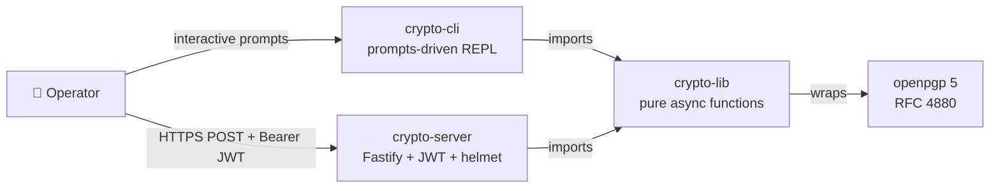

# 🔐 The Crypto Service Suite

A pnpm/Lerna monorepo of four TypeScript packages providing OpenPGP key
management, encryption, signing, verification, and a Fastify REST front, on top
of [OpenPGP.js](https://openpgpjs.org/) (RFC 4880).

[](https://github.com/sebastienrousseau/crypto-service/actions/workflows/coveralls.yml)
[](https://coveralls.io/github/sebastienrousseau/crypto-service?branch=main)
[](LICENSE)
[](https://lerna.js.org/)
[](https://pnpm.io/)

## Packages

| Package | Role | Published |
|---|---|---|
| [`@sebastienrousseau/crypto-lib`](packages/crypto-lib)       | Pure async functions over openpgp 5. Caller supplies armored keys; the library never touches the filesystem. | ✅ |
| [`@sebastienrousseau/crypto-server`](packages/crypto-server) | Fastify REST front (`/v1/{encrypt,decrypt,sign,verify,generate,revoke,reformat,session}`) with JWT auth, helmet, rate-limit, schema validation. | ✅ |
| [`@sebastienrousseau/crypto-cli`](packages/crypto-cli)       | Prompts-driven interactive CLI for the same eight operations, talking to `crypto-lib` directly. | ✅ |
| [`@sebastienrousseau/crypto-api`](packages/crypto-api)       | Internal Postman → Markdown documentation generator. **Not published.** | 🔒 private |

See [`docs/architecture.md`](docs/architecture.md) for the C4 diagram and
request lifecycle.

---

## Quick Start (15 minutes, all platforms)

### Prerequisites

| Tool    | Version    | Why |
|---------|------------|---|
| Node.js | **≥ 20.18** | Engines field across all packages. Node 18 is EOL since April 2025. |
| pnpm    | **≥ 9**     | Workspace tooling. Install via `corepack enable && corepack prepare pnpm@9 --activate`. |
| Git     | any        | Sign your commits — see [`.github/CONTRIBUTING.md`](.github/CONTRIBUTING.md). |

#### Platform notes

- **macOS:**
  ```bash
  brew install node@20
  corepack enable
  ```
- **Linux / WSL:** use [`mise`](https://mise.jdx.dev) (preferred) or [`nvm`](https://github.com/nvm-sh/nvm):
  ```bash
  mise use -g node@20.18
  corepack enable
  ```
- **Windows (native PowerShell):** install Node.js 20.18 LTS via the MSI, then from an Admin shell:
  ```powershell
  corepack enable
  ```

### Clone, install, build, test

```bash
git clone git@github.com:sebastienrousseau/crypto-service.git
cd crypto-service
pnpm install --frozen-lockfile
pnpm -r run build
pnpm -r run test
```

Expected last lines:

```
packages/crypto-api    test:  107 passing
packages/crypto-lib    test:   24 passing
packages/crypto-server test:   11 passing
packages/crypto-cli    test:    8 passing
```

### Hello World — encrypt + decrypt with `crypto-lib`

```ts
import { generate, encrypt, decrypt } from "@sebastienrousseau/crypto-lib";

const key = await generate({
  name: "Jane Doe",
  email: "jane@doe.com",
  passphrase: "correct horse battery staple",
  type: "ecc",                           // or "rsa"
  keyExpirationTime: 60 * 60 * 24 * 365, // 1 year (0 = never expires)
});

const ciphertext = await encrypt({
  message: "Hello Crypto Service Suite!",
  encryptionKey: key.publicKey, // ASCII-armored
});

const result = await decrypt({
  encryptedMessage: ciphertext,
  decryptionKey: {
    armored: key.privateKey,
    passphrase: "correct horse battery staple",
  },
});

console.log(result.data); // "Hello Crypto Service Suite!"
```

### Hello World — boot the REST server

```bash
# 1. Mint a 32-character JWT secret. The server refuses to start with anything shorter.
export JWT_SECRET="$(openssl rand -hex 32)"

# 2. Start the server.
pnpm --filter @sebastienrousseau/crypto-server start
# → 🚀 Server listening on http://127.0.0.1:3000/

# 3. From another terminal, mint a tester JWT and call /v1/generate.
#    (Replace this with your real token-issuance flow in production.)
TOKEN=$(node -e "console.log(require('jsonwebtoken').sign({sub:'tester'}, process.env.JWT_SECRET))")

curl -s -X POST http://127.0.0.1:3000/v1/generate \
  -H "Authorization: Bearer $TOKEN" \
  -H "Content-Type: application/json" \
  -d '{
    "name": "Jane Doe",
    "email": "jane@doe.com",
    "passphrase": "correct horse battery staple",
    "type": "ecc"
  }' | jq '.data.publicKey'
```

---

## Architecture (at a glance)



Long form: [`docs/architecture.md`](docs/architecture.md) and the per-package
READMEs.

---

## Repository Layout

```
.
├── .github/                  ← CI workflows, issue templates, CONTRIBUTING, SECURITY
├── .husky/                   ← husky 8 git hooks (pre-commit runs pnpm -r lint)
├── docs/                     ← architecture notes
├── packages/
│   ├── crypto-lib/           ← pure crypto core
│   │   ├── src/
│   │   │   ├── lib/          ← generate / encrypt / decrypt / sign / verify / revoke / reformat / session
│   │   │   ├── types/        ← public input/output types
│   │   │   └── bin/          ← cryptolib re-export entrypoint
│   │   └── __tests__/        ← mocha specs
│   ├── crypto-server/        ← Fastify REST front
│   │   ├── src/routes/v1/    ← one file per endpoint
│   │   ├── src/config/       ← server constants + redact paths
│   │   └── __tests__/        ← server.test.ts
│   ├── crypto-cli/           ← interactive prompts CLI
│   │   └── src/commands/     ← one file per crypto-lib operation
│   └── crypto-api/           ← (private) Postman → Markdown doc generator
├── tsconfig.base.json        ← TS strict + exactOptionalPropertyTypes (project-wide)
├── lerna.json                ← independent versioning, pnpm client
└── pnpm-workspace.yaml
```

---

## Development Workflow

| Task                          | Command |
|-------------------------------|---------|
| Install / refresh deps        | `pnpm install --frozen-lockfile` |
| Build all packages            | `pnpm -r run build` |
| Lint all packages             | `pnpm -r run lint`  (also runs as a pre-commit hook) |
| Lint with autofix             | `pnpm -r run lint:fix` |
| Test all packages             | `pnpm -r run test` |
| Test a single package         | `pnpm --filter @sebastienrousseau/crypto-lib run test` |
| Generate API docs (typedoc)   | `pnpm -r run docs` |
| Clean all build artefacts     | `pnpm -r run clean` |
| Start the REST server         | `JWT_SECRET=<32+ chars> pnpm --filter @sebastienrousseau/crypto-server start` |
| Launch the interactive CLI    | `pnpm --filter @sebastienrousseau/crypto-cli start` |

The Makefile at the repo root mirrors the most common targets (`make build`,
`make test`, `make lint`) for `make`-friendly editors.

---

## Environment Variables

All variables are read by `crypto-server` only.

| Name             | Default      | Required | Notes |
|------------------|--------------|----------|---|
| `JWT_SECRET`     | _(none)_     | **yes**  | Must be ≥ 32 chars. Server refuses to start otherwise. |
| `HOST`           | `127.0.0.1`  | no       | Bind address. |
| `PORT`           | `3000`       | no       | Listen port. |
| `PROTOCOL`       | `http`       | no       | Cosmetic — used for the welcome banner only. Terminate TLS at your reverse proxy. |
| `CORS_ORIGINS`   | _(deny all)_ | no       | Comma-separated allow-list. Default behaviour is **deny all** — set explicitly for browser clients. |
| `TRUST_PROXY`    | _(off)_      | no       | Comma-separated CIDR list. Without this, the rate-limiter trusts the socket address verbatim — exactly what you want unless you're behind a known proxy. |
| `LOG_LEVEL`      | `info`       | no       | Pino level. |

---

## Troubleshooting

| Symptom | Fix |
|---|---|
| `Error: JWT_SECRET environment variable is required` on startup | Export a 32+ char secret: `export JWT_SECRET="$(openssl rand -hex 32)"`. |
| `pnpm install` reports lockfile mismatch | Make sure you're on Node ≥ 20.18 and pnpm 9. Run `corepack prepare pnpm@9 --activate`. |
| `Error: No test files found` from `crypto-server` | You're on a stale checkout from before #107. Pull `main`. |
| RSA-4096 keygen test times out on slow machines | Pure CPU work — bump the per-test timeout in `packages/crypto-lib/__tests__/lib/generate.test.ts` (currently 180s). |
| `git push` fails with `remote: Permission denied` | Origin defaults to HTTPS; switch the push URL to SSH: `git remote set-url --push origin git@github.com:<owner>/crypto-service.git`. |
| Pre-commit hook is silent on a fresh clone | Run `pnpm install` once after cloning — that fires the `prepare` script which wires `.husky/`. |
| `Cannot find any files matching pattern "./test/**/*"` | Cosmetic warning from the inherited mocha config. Tests live under `__tests__/`; the warning is harmless. |

---

## Releases

Releases are cut from `main` via Lerna's independent versioning. Tagged
releases are at
[github.com/sebastienrousseau/crypto-service/releases](https://github.com/sebastienrousseau/crypto-service/releases).

Crypto Service Suite follows [semantic versioning](https://semver.org/). The
public API is `crypto-lib`'s eight pure functions and the `crypto-server` v1
HTTP surface.

---

## Contributing

- Read [`.github/CONTRIBUTING.md`](.github/CONTRIBUTING.md).
- **Sign your commits.** SSH or GPG signing is required. One-time setup:
  ```bash
  git config commit.gpgsign true
  git config gpg.format ssh                # or 'openpgp'
  git config user.signingkey ~/.ssh/<your_key>.pub
  ```
- Use [conventional commits](.github/conventional_commit_messages.md)
  (`feat:`, `fix:`, `docs:`, …).
- Open a PR against `main` and make sure CI is green before requesting
  review.

---

## Security

Please report vulnerabilities privately via
[`.github/SECURITY.md`](.github/SECURITY.md). The CI hygiene job blocks any
commit that adds `.key`, `.asc`, `.pem`, `.p12`, or `.pfx` files to the tree.

---

## Code of Conduct

We are committed to preserving and fostering a diverse, welcoming community.
Please read our
[Code of Conduct](.github/CODE-OF-CONDUCT.md).

---

## License

MIT — see [LICENSE](LICENSE). Copyright © Sebastien Rousseau.
