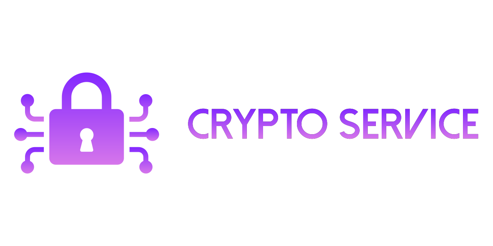

<!-- SPDX-License-Identifier: Apache-2.0 OR MIT -->

<p align="center">
  
</p>

<h1 align="center">Crypto Service</h1>

<p align="center">
  A comprehensive TypeScript cryptography toolkit — 50+ algorithms, post-quantum ready, full-stack integration.
</p>

<p align="center">
  <a href="https://github.com/sebastienrousseau/crypto-service/actions"></a>
  <a href="https://coveralls.io/github/sebastienrousseau/crypto-service?branch=main"></a>
  <a href="https://www.npmjs.com/package/@sebastienrousseau/crypto-service"></a>
  <a href="https://sebastienrousseau.github.io/crypto-service/"></a>
  <a href="https://scorecard.dev/viewer/?uri=github.com/sebastienrousseau/crypto-service" title="ossf-scorecard"></a>
  <a href="LICENSE"></a>
  <a href="https://github.com/sebastienrousseau/crypto-service/blob/main/docs/POLICIES.md"></a>
</p>

---

## Contents

**Getting started**

- [Install](#install) — pnpm, npm, yarn, source, and Docker
- [Requirements](#requirements) — toolchain floor, platforms
- [Quick Start](#quick-start) — core encryption, hashing, and CLI usage

**The Crypto Service ecosystem**

- [The Crypto Service ecosystem](#the-crypto-service-ecosystem) — 18 specialized packages across library, server, SDK, CLI, AI tooling, and framework adapters

**Library reference**

- [Capabilities at a glance](#capabilities-at-a-glance) — the current surface by theme
- [Ecosystem comparison](#ecosystem-comparison) — short matrix; full table at [`docs/COMPARISON.md`](docs/COMPARISON.md)
- [Benchmarks](#benchmarks) — headline numbers; full table at [`docs/BENCHMARKS.md`](docs/BENCHMARKS.md)
- [Features](#features) — module-level capability list
- [Configuration](#configuration) — core options and environment variables
- [Examples](#examples) — runnable example index

**Operational**

- [When not to use Crypto Service](#when-not-to-use-crypto-service) — limitations and operational boundaries
- [Development](#development) — pnpm tasks, coverage, gates, and CI
- [Security](#security) — guarantees and compliance
- [Documentation](#documentation) — all reference docs
- [Stability guarantees](#stability-guarantees) — SemVer axis, output stability, minimum toolchain discipline
- [License](#license)

---

## Install

### As a Node.js / TypeScript library

```bash
pnpm add @sebastienrousseau/crypto-lib
```

Crypto Service is distributed as a family of scoped npm packages. Install only what
you need, or clone the entire monorepo for full-stack development.

| Method                 | Command / Steps                                                                                                               |
| :--------------------- | :---------------------------------------------------------------------------------------------------------------------------- |
| **pnpm** (recommended) | `pnpm add @sebastienrousseau/crypto-lib` (npm has 0.0.3; see note below)                                                      |
| **npm**                | `npm install @sebastienrousseau/crypto-lib`                                                                                   |
| **yarn**               | `yarn add @sebastienrousseau/crypto-lib`                                                                                      |
| **From source**        | `git clone https://github.com/sebastienrousseau/crypto-service.git && cd crypto-service && pnpm install && pnpm -r run build` |
| **Docker**             | `docker run -p 3000:3000 ghcr.io/sebastienrousseau/crypto-service:latest`                                                     |

Docker container images are published to GHCR. Standalone distro packages and Repology tracking will be established once packaged by distributions.

### Individual packages

From 0.0.8, every tagged release publishes all 18 packages to npm and
to GitHub Packages from CI. From 0.0.9, CI stages the npm versions
through trusted publishing and a maintainer approves them with 2FA
before they go public; each version is then checked for a provenance
attestation (0.0.8 was published without one):

```bash
pnpm add @sebastienrousseau/crypto-lib
pnpm add @sebastienrousseau/crypto-server
pnpm add -g @sebastienrousseau/crypto-cli
```

Releases before 0.0.8 reached npm only partially (crypto-lib 0.0.3,
crypto-server 0.0.2, crypto-cli 0.0.1); do not use those versions.

---

## Requirements

Node.js **>= 22.0.0** (CI tests Node.js 22 and 24 on Ubuntu and macOS).
Package manager: **pnpm >= 9.0.0** (monorepo workspaces).
TypeScript: **~5.9.3** for development.
Docker images require Docker 20.10+ or a compatible OCI runtime.
See [toolchain policy](docs/POLICIES.md).

---

## Quick Start

```typescript
import { randomBytes } from "node:crypto";
import {
  aesGcmEncrypt,
  aesGcmDecrypt,
  hash,
  mlKemKeygen,
  mlKemEncap,
  mlKemDecap,
  slhDsaKeygen,
  slhDsaSign,
  slhDsaVerify,
} from "@sebastienrousseau/crypto-lib";

// 1. Authenticated encryption with AES-256-GCM (32-byte key)
const key = randomBytes(32);
const { ciphertext } = aesGcmEncrypt({ key, plaintext: "Sensitive payload" });
const plaintext = new TextDecoder().decode(aesGcmDecrypt({ key, ciphertext }));

// 2. Hashing with SHA-256 (hex digest)
const { digest } = hash({ algorithm: "sha256", data: "Integrity check" });

// 3. ML-KEM-768 key encapsulation (FIPS 203 algorithm)
const kem = mlKemKeygen(768);
const sent = mlKemEncap(768, kem.publicKey);
const received = mlKemDecap(768, kem.secretKey, sent.ciphertext);
// received.sharedSecret === sent.sharedSecret

// 4. SLH-DSA signatures (FIPS 205 algorithm)
const signer = slhDsaKeygen("sha2-128s");
const { signature } = slhDsaSign("sha2-128s", signer.secretKey, "Message");
const { valid } = slhDsaVerify(
  "sha2-128s",
  signer.publicKey,
  "Message",
  signature,
);
```

The post-quantum algorithms come from `@noble/post-quantum`, which has not
been independently audited and does not guarantee constant-time execution.
No module in this suite is FIPS 140-3 validated.

The CLI is interactive: run it with no arguments and pick an operation from
the menu.

```bash
crypto-cli
```

---

## The Crypto Service ecosystem

All 18 packages follow a coordinated versioning policy with automated CI enforcement and lockstep releases.

> [!NOTE]
> **Registry availability**: from 0.0.8 every package is published to npm and GitHub Packages on each tagged release. Earlier npm versions of `@sebastienrousseau/crypto-service`, `crypto-lib`, `crypto-server` and `crypto-cli` predate this repository's fixes; use 0.0.8 or later.

| Component                                                            | Purpose                                                              | Use case                                             | Registry Availability |
| :------------------------------------------------------------------- | :------------------------------------------------------------------- | :--------------------------------------------------- | :-------------------- |
| [`@sebastienrousseau/crypto-lib`](packages/crypto-lib)               | Core crypto library: classical, modern and post-quantum algorithms   | Standalone library for Node.js, browsers, and Edge   | npm (0.0.8+)          |
| [`@sebastienrousseau/crypto-server`](packages/crypto-server)         | Fastify REST API service                                             | Cryptography-as-a-service microservice               | npm (0.0.8+)          |
| [`@sebastienrousseau/crypto-cli`](packages/crypto-cli)               | Interactive terminal CLI                                             | DevOps automation, local keygen, and file encryption | npm (0.0.8+)          |
| [`@sebastienrousseau/crypto-sdk`](packages/crypto-sdk)               | Typed TypeScript SDK client for the REST API                         | Client applications consuming the REST service       | npm (0.0.8+)          |
| [`@sebastienrousseau/crypto-api`](packages/crypto-api)               | Shared TypeScript types for the REST API surface                     | Shared HTTP contract                                 | npm (0.0.8+)          |
| [`@sebastienrousseau/crypto-middleware`](packages/crypto-middleware) | Express and Fastify request encryption/decryption middleware         | Automated payload encryption in HTTP pipelines       | npm (0.0.8+)          |
| [`@sebastienrousseau/crypto-react`](packages/crypto-react)           | React hooks (`useEncryption`, `useKeypair`, etc.)                    | Web application client-side cryptography             | npm (0.0.8+)          |
| [`@sebastienrousseau/crypto-vue`](packages/crypto-vue)               | Vue 3 composables for reactive cryptography                          | Vue/Nuxt client-side encryption and hashing          | npm (0.0.8+)          |
| [`@sebastienrousseau/crypto-edge`](packages/crypto-edge)             | Cloudflare Workers, Vercel Edge, and Deno runtime adapters           | Serverless and edge cryptographic processing         | npm (0.0.8+)          |
| [`@sebastienrousseau/crypto-kms`](packages/crypto-kms)               | KMS interface: AWS and local providers; GCP/Azure/Vault are stubs    | Envelope encryption and key rotation                 | npm (0.0.8+)          |
| [`@sebastienrousseau/crypto-prisma`](packages/crypto-prisma)         | Prisma client extension for transparent field encryption             | Field-level encryption before data reaches the DB    | npm (0.0.8+)          |
| [`@sebastienrousseau/crypto-typeorm`](packages/crypto-typeorm)       | TypeORM column transformer for encrypted persistence                 | Transparent database column encryption               | npm (0.0.8+)          |
| [`@sebastienrousseau/crypto-wasm`](packages/crypto-wasm)             | Placeholder: contains no WebAssembly code yet                        | None yet; operations run in JavaScript               | npm (0.0.8+)          |
| [`@sebastienrousseau/crypto-testing`](packages/crypto-testing)       | Cryptographic test utilities, known-answer tests, and mocks          | Testing downstream applications using crypto-service | npm (0.0.8+)          |
| [`@sebastienrousseau/crypto-mcp`](packages/crypto-mcp)               | Model Context Protocol server exposing crypto tools & prompts        | AI agent integration (Claude, Cursor, Antigravity)   | npm (0.0.8+)          |
| [`@sebastienrousseau/crypto-lsp`](packages/crypto-lsp)               | Language Server Protocol server for crypto diagnostics & migration   | IDE real-time analysis, PEM linting, quick fixes     | npm (0.0.8+)          |
| [`@sebastienrousseau/crypto-cbom`](packages/crypto-cbom)             | Cryptographic Bill of Materials generator (CycloneDX 1.6 / SPDX 3.0) | Cryptographic inventory tracking                     | npm (0.0.8+)          |
| [`@sebastienrousseau/crypto-benchmarks`](packages/crypto-benchmarks) | Comparative benchmarking suite (classical vs post-quantum)           | Performance regression testing and throughput checks | npm (0.0.8+)          |

---

## Capabilities at a glance

All algorithms run in software. No module in this suite is FIPS 140-3
validated; the FIPS numbers below name the algorithm standards implemented.

| Area                    | Capability                                                                       | Implementation                         |
| :---------------------- | :------------------------------------------------------------------------------- | :------------------------------------- |
| Symmetric AEAD          | AES-128/256-GCM, AES-128/256-GCM-SIV, XChaCha20-Poly1305                         | `@noble/ciphers`                       |
| Signatures              | Ed25519, Ed448, ECDSA P-256/P-384, Schnorr (BIP-340)                             | `@noble/curves`                        |
| Key Exchange & KEM      | X25519, X448, ECDH P-256/P-384, ML-KEM-512/768/1024 (FIPS 203), hybrid KEMs      | `@noble/curves`, `@noble/post-quantum` |
| Post-Quantum Signatures | ML-DSA-44/65/87 (FIPS 204), SLH-DSA SHA-2/SHAKE (FIPS 205), FN-DSA-512/1024      | `@noble/post-quantum`                  |
| Hybrid Encryption       | HPKE (RFC 9180)                                                                  | `@noble/*`                             |
| Hash Functions          | SHA-256/384/512, SHA3-256/512, BLAKE2b, BLAKE3                                   | `@noble/hashes`                        |
| Key Derivation (KDF)    | HKDF-SHA256, PBKDF2-SHA256, scrypt, Argon2id/i/d                                 | `@noble/hashes`                        |
| Message Authentication  | HMAC (SHA-2, SHA-3), KMAC-128/256                                                | `@noble/hashes`                        |
| OpenPGP                 | Key generation, encryption, signing, revocation (RSA and ECC keys)               | OpenPGP.js                             |
| Protocols & Tokens      | PQXDH, double ratchet, PAKE, Shamir threshold sharing, PASETO v4                 | crypto-lib (built on `@noble/*`)       |
| Observability (server)  | OpenTelemetry tracing and metrics, Prometheus-format metrics endpoint, JSON logs | crypto-server                          |

---

## Ecosystem comparison

This matrix compares Crypto Service's unified TypeScript architecture against alternative solutions.

| Project            |   Algorithm Coverage    |  Post-Quantum (FIPS 203/204/205)  | Full-Stack Integrations (ORM/React/Vue/CLI) |
| :----------------- | :---------------------: | :-------------------------------: | :-----------------------------------------: |
| **Crypto Service** |   **50+ algorithms**    | **Yes (ML-KEM, ML-DSA, SLH-DSA)** | **Yes (Prisma, TypeORM, React, Vue, CLI)**  |
| Web Crypto API     |  Standard web set only  |       No native PQ support        |     No (low-level browser/runtime only)     |
| Node.js `crypto`   |  Classical OpenSSL set  | Experimental / OpenSSL-dependent  |         No (standard library only)          |
| libsodium          | High-level modern suite |      No (pre-quantum focus)       |         Partial community bindings          |

See [`docs/COMPARISON.md`](docs/COMPARISON.md) for the evidence and complete matrix.

---

## Benchmarks

No benchmark numbers are published yet. Earlier figures in this section did
not come from committed benchmark code and were removed. Run
`node benchmarks/crypto-bench.ts` after `pnpm -r run build` to measure on
your own hardware; CI runs the same script on pull requests to `main`. See
[`docs/BENCHMARKS.md`](docs/BENCHMARKS.md).

---

## Features

### Unified Cryptographic API

- Consistent interface for all algorithms: encryption, hashing, signing, key generation, and key derivation.
- Built-in type definitions, strict input validation, and automatic serialization/deserialization.
- Support for classical algorithms (AES, RSA, ECC, HMAC) and modern primitives (ChaCha20-Poly1305, Ed25519, X25519).

### Post-Quantum Cryptography (FIPS 203, 204, 205)

- **ML-KEM (FIPS 203)**: Module-Lattice-Based Key-Encapsulation Mechanism across security categories (512, 768, 1024).
- **ML-DSA (FIPS 204)**: Module-Lattice-Based Digital Signature Algorithm across parameter sets (44, 65, 87).
- **SLH-DSA (FIPS 205)**: Stateless Hash-Based Digital Signature Algorithm supporting SHA-2 and SHAKE parameter sets.

### Full-Stack Architecture

- **Microservice Ready**: Preconfigured Fastify server (`@sebastienrousseau/crypto-server`) with OpenAPI/Swagger schemas.
- **Client SDK**: Typed SDK (`@sebastienrousseau/crypto-sdk`) for the REST API.
- **Command-Line Interface**: Interactive terminal CLI (`@sebastienrousseau/crypto-cli`).
- **UI Framework Hooks**: React hooks (`@sebastienrousseau/crypto-react`) and Vue 3 composables (`@sebastienrousseau/crypto-vue`).
- **Database Field Encryption**: Transparent field-level encryption extensions for Prisma (`@sebastienrousseau/crypto-prisma`) and TypeORM (`@sebastienrousseau/crypto-typeorm`).

---

## Configuration

### Command-Line Interface (`crypto-cli`)

`crypto-cli` takes no subcommands or flags. Run it and choose an operation
from the interactive menu:

```bash
crypto-cli
```

### Server Configuration (`crypto-server`)

The REST API server is configured via environment variables:

| Variable                      | Description                                     | Default                |
| :---------------------------- | :---------------------------------------------- | :--------------------- |
| `PORT`                        | HTTP server port                                | `3000`                 |
| `HOST`                        | Bind host address                               | `localhost`            |
| `LOG_LEVEL`                   | Logger level (`error`, `warn`, `info`, `debug`) | `info`                 |
| `OTEL_EXPORTER_OTLP_ENDPOINT` | OpenTelemetry OTLP collector endpoint           | None (export disabled) |
| `CRYPTO_API_KEY`              | Static API key for service-to-service requests  | None                   |
| `JWT_SECRET`                  | HMAC secret for HS256 JWT validation            | None                   |
| `JWT_MAX_AGE`                 | Maximum JWT lifetime in seconds                 | `3600`                 |
| `JWT_ISSUER`                  | Required JWT `iss` claim                        | None (not checked)     |
| `JWT_AUDIENCE`                | Required JWT `aud` value                        | None (not checked)     |
| `ALLOW_ANONYMOUS`             | `1` allows unauthenticated requests             | Off                    |
| `CRYPTO_KEY_DIR`              | Keystore for the v1 PGP routes                  | Bundled test keys      |
| `CRYPTO_KEY_OUT_DIR`          | Where generated keys are persisted              | None (memory only)     |

With neither `CRYPTO_API_KEY` nor `JWT_SECRET` set, every request except `/health`, `/live`, `/ready`, `/metrics` and `/docs` gets `401`. In production (`NODE_ENV=production`) the server refuses to start without a credential unless `ALLOW_ANONYMOUS=1` is set (for example behind an authenticating gateway), rejects a `JWT_SECRET` shorter than 32 bytes or set without `JWT_ISSUER` and `JWT_AUDIENCE`, and refuses the bundled test keys unless `CRYPTO_KEY_DIR` is set.

---

## Examples

Runnable example code and integration patterns are located in [`examples/`](examples/):

### Middleware Integration (Express / Fastify)

```typescript
import Fastify from "fastify";
import { cryptoPlugin } from "@sebastienrousseau/crypto-middleware";

const app = Fastify();
await app.register(cryptoPlugin, {
  key: process.env.PAYLOAD_KEY, // 64 hex characters (256-bit key)
  routes: ["/api/**"],
  operations: ["decrypt-request", "encrypt-response"],
});
```

### Prisma Transparent Field Encryption

```typescript
import { PrismaClient } from "@prisma/client";
import { createFieldEncryptionExtension } from "@sebastienrousseau/crypto-prisma";

const prisma = new PrismaClient().$extends(
  createFieldEncryptionExtension({
    key: process.env.ENCRYPTION_KEY!, // 64 hex characters (256-bit key)
    encryptedFields: [{ model: "User", fields: ["ssn", "dateOfBirth"] }],
  }),
);
```

---

## When not to use Crypto Service

- **You need a FIPS 140-3 validated module**: nothing in this suite is validated. The FIPS 203/204/205 algorithms come from `@noble/post-quantum`, which is not a validated module.
- **You need an HSM or PKCS#11**: there is no PKCS#11 binding. The crypto-kms `Pkcs11HsmProvider` is an in-memory software simulation for tests; the GCP, Azure and Vault KMS providers are stubs.
- **You need audited or guaranteed constant-time post-quantum code**: `@noble/post-quantum` has not been independently audited and does not guarantee constant-time execution.
- **Embedded bare-metal microcontrollers**: devices without a Node.js or browser JavaScript runtime.

---

## Development

```bash
pnpm install
pnpm -r run build
pnpm -r run lint
pnpm -r run format
pnpm -r run test
pnpm -r run docs
```

CI enforces 100% line and function coverage in every package, and 100% branch coverage in every package except crypto-lib (99.5%).
Pull requests must pass the complete CI matrix before merge. See [DEVELOPMENT.md](DEVELOPMENT.md) for local gate reproduction and [CONTRIBUTING.md](CONTRIBUTING.md) for commit and PR guidelines.

---

## Security

Report vulnerabilities privately according to [`SECURITY.md`](SECURITY.md). Never file public issues for security vulnerabilities.

Cryptographic operations use `@noble/hashes`, `@noble/curves`, `@noble/ciphers`, `@noble/post-quantum`, Node.js `crypto` and OpenPGP.js. `@noble/post-quantum` has not been independently audited and does not guarantee constant-time execution. No module in this suite is FIPS 140-3 validated. Key zeroization is limited: JavaScript strings and garbage-collected buffers cannot be reliably wiped. Not every secret comparison is constant-time (see [`SECURITY.md`](SECURITY.md)). CI runs `pnpm audit`, CodeQL analysis and SBOM generation.

Report vulnerabilities according to [`SECURITY.md`](SECURITY.md).

---

## Documentation

- [User manual & guides](docs/)
- [API reference (TypeDoc)](https://sebastienrousseau.github.io/crypto-service/)
- [Developer guide](DEVELOPMENT.md)
- [Architecture](ARCHITECTURE.md)
- [Ecosystem comparison](docs/COMPARISON.md)
- [Benchmarks](docs/BENCHMARKS.md)
- [Migration guide](MIGRATION.md)
- [Security policy](SECURITY.md)
- [Support guide](SUPPORT.md)
- [Changelog](CHANGELOG.md)

---

## Stability guarantees

Versions advance strictly one step at a time on the `0.0.x` line (`v0.0.1` → `v0.0.2` → `v0.0.3` ... → `v0.0.999` → `v0.1.0`). Work for every release iteration begins on a dedicated `feat/v<version>` branch.

All packages in the suite move in lockstep. Public API signatures, cipher output formats, and serialization schemas are strictly versioned. Breaking changes to serialized ciphertext formats, key formats, or algorithm defaults are considered major breaking changes. Minimum toolchain upgrades (e.g. Node.js LTS floor) are governed by [POLICIES.md](docs/POLICIES.md) and announced in advance.

---

## License

Dual-licensed under [Apache-2.0](LICENSE-APACHE) OR [MIT](LICENSE-MIT), at your option. See [LICENSE](LICENSE). Dependencies retain their own licenses.
