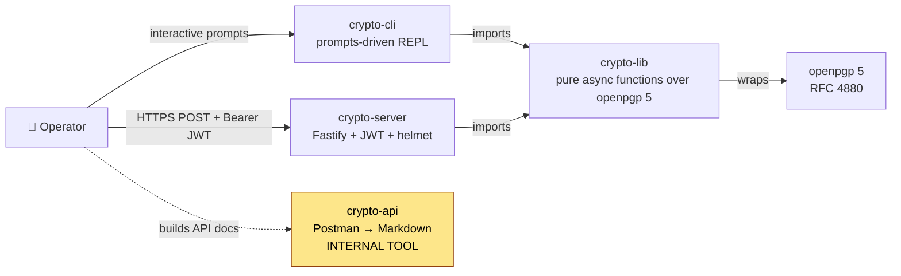
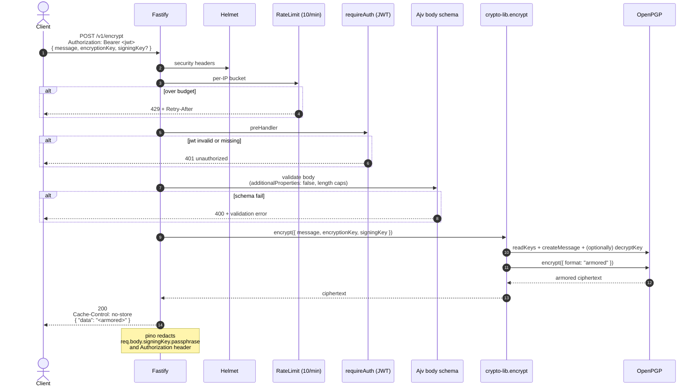
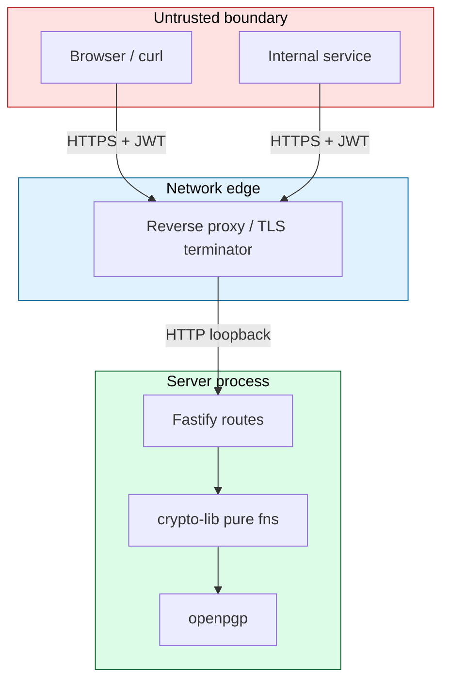
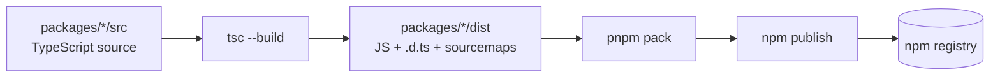

# Architecture

This document explains how the four packages of the Crypto Service Suite fit
together, what each layer is responsible for, and *why* the design choices
were made the way they were.

For a top-down product summary, see the root [README](../README.md). For
package-level usage, see each package's `README.md`.

---

## 1. Container View

| Container | Role | Talks to |
|---|---|---|
| `crypto-lib` | Pure crypto core. No FS, no network, no global state. | openpgp 5 |
| `crypto-server` | Authenticated REST front. One file per endpoint under `src/routes/v1/`. | crypto-lib |
| `crypto-cli` | Interactive prompts UX for ops/operators. One file per operation under `src/commands/`. | crypto-lib |
| `crypto-api` | Generates Markdown reference docs from a Postman collection. **`private: true`** in `package.json`. | filesystem only |

---

## 2. Request Lifecycle — `POST /v1/encrypt`

The same shape applies to `/v1/decrypt`, `/v1/sign`, `/v1/verify`,
`/v1/generate`, `/v1/revoke`, `/v1/reformat`, and `/v1/session`.

---

## 3. Layered Defenses on Every `/v1/*` Route

| # | Layer | Source | What it catches |
|---|---|---|---|
| 1 | Helmet headers          | `crypto-server/src/server.ts:48` | click-jacking, MIME sniffing, XSS framing |
| 2 | CORS default-deny       | `crypto-server/src/server.ts:49` | browsers from non-allow-listed origins |
| 3 | Compression threshold   | `crypto-server/src/config/constants.ts` | tiny payloads bypass gzip cost |
| 4 | Rate limit (10/min/IP)  | `crypto-server/src/config/constants.ts` | brute force, cost amplification |
| 5 | JWT preHandler          | `crypto-server/src/server.ts:58` | unauthenticated callers |
| 6 | Ajv body schema         | per route file (`crypto-server/src/routes/v1/*.ts`) | type confusion, oversize bodies, prototype pollution (`onProtoPoisoning: "error"`) |
| 7 | Pure-function lib call  | `crypto-lib/src/lib/*.ts` | returns ciphertext or throws — no side effects |
| 8 | Pino redaction          | `crypto-server/src/config/constants.ts:50-61` | passphrase / Authorization-header leakage in logs |
| 9 | `Cache-Control: no-store` on every response | per route | intermediate caches |

---

## 4. Why Pure Functions in `crypto-lib`?

The library deliberately exposes only pure async functions over
ASCII-armored key material. It never touches the filesystem and never logs
passphrases. This means:

- The same code path drives the CLI, the REST server, and any third-party
  consumer — no hidden FS state to reason about per host.
- Tests don't need fixtures on disk and run cleanly in CI sandboxes.
- The CI hygiene job (`.github/workflows/coveralls.yml:16-22`) fails the
  build on any committed `.key`, `.asc`, `.pem`, `.p12`, or `.pfx`, so the
  "purity" guarantee is enforced at merge time.
- A regression-guard test in
  `packages/crypto-lib/__tests__/no-legacy-config.test.ts` fails the build
  if the legacy `enums.ts` (`keySize512`/`keySize1024`) or `config/config.ts`
  (NIST P-256 default) modules reappear.

The eight public functions are:

| Function | Returns | Notes |
|---|---|---|
| `generate(input)` | `{ publicKey, privateKey, revocationCertificate }` | RSA ≥ 2048 enforced; ECC defaults to curve25519 |
| `encrypt(input)`  | armored ciphertext | optional signing key |
| `decrypt(input)`  | `{ data, signatures }` | verifies embedded signatures if `verificationKey` provided |
| `sign(input)`     | armored cleartext-signed message OR detached signature | controlled by `detached` flag |
| `verify(input)`   | `{ valid: true, signedBy }` | **throws** on invalid or missing signature |
| `revoke(input)`   | `{ publicKey, privateKey }` (revoked forms) | RFC 4880 §5.2.3.23 reason flags supported |
| `reformat(input)` | `{ publicKey, privateKey }` | re-issues self-signatures with a new userID/expiration |
| `session(input)`  | `openpgp.SessionKey` | honours recipient key's algorithm preferences |

---

## 5. Why JWT, Not API Keys?

`crypto-server` uses `@fastify/jwt` with a server-side `JWT_SECRET`
(≥ 32 chars enforced at boot). Token issuance is intentionally **not** part
of this server — operators are expected to mint tokens out-of-band using
their existing IdP.

This keeps the server's blast radius small: lose the JWT secret, rotate it,
restart. There is no user database to migrate, no password reset flow to
implement, and no credential storage to secure.

> **There is no `/v1/login` endpoint by design.** If you need one, build it
> in front of `crypto-server` in your existing identity layer.

---

## 6. When to Use Which Package

| You want to... | Use |
|---|---|
| Encrypt/sign data inside another Node.js / TypeScript app | `@sebastienrousseau/crypto-lib` directly |
| Run an interactive REPL on a workstation | `@sebastienrousseau/crypto-cli` |
| Expose crypto operations to non-Node clients (HTTP) | `@sebastienrousseau/crypto-server` |
| Generate Markdown docs from a Postman collection | `@sebastienrousseau/crypto-api` (internal, not published) |

---

## 7. Trust Boundaries

- **TLS termination is NOT crypto-server's job.** Run it behind a reverse
  proxy (nginx, Caddy, Cloudflare) that terminates TLS.
- **`TRUST_PROXY` defaults to `false`.** Without it, the rate limiter trusts
  the socket address verbatim — exactly what you want unless you're behind
  a known proxy. Set `TRUST_PROXY` to a comma-separated CIDR allow-list of
  *your* proxies, never `true`.
- **`CORS_ORIGINS` defaults to deny-all.** Set it explicitly for browser
  clients.

---

## 8. Build & Release Topology

- Each package has its own `tsconfig.json` that extends the root
  `tsconfig.base.json` (TS strict + `exactOptionalPropertyTypes`).
- `pnpm -r run build` builds every package in dependency order.
- `crypto-cli` and `crypto-server` declare a `workspace:*` dependency on
  `crypto-lib` so they always pick up the local source during development.
- The `prepack` hook in each package re-runs `pnpm run build` so a published
  tarball can never be stale.

---

## 9. Where to Read Next

| Topic | File |
|---|---|
| Public API of the crypto core | [`packages/crypto-lib/README.md`](../packages/crypto-lib/README.md) |
| REST endpoints + curl examples | [`packages/crypto-server/README.md`](../packages/crypto-server/README.md) |
| CLI prompts + screencast | [`packages/crypto-cli/README.md`](../packages/crypto-cli/README.md) |
| Postman → Markdown tooling | [`packages/crypto-api/README.md`](../packages/crypto-api/README.md) |
| Security model & reporting | [`.github/SECURITY.md`](../.github/SECURITY.md) |
| Contribution rules + signed commits | [`.github/CONTRIBUTING.md`](../.github/CONTRIBUTING.md) |
