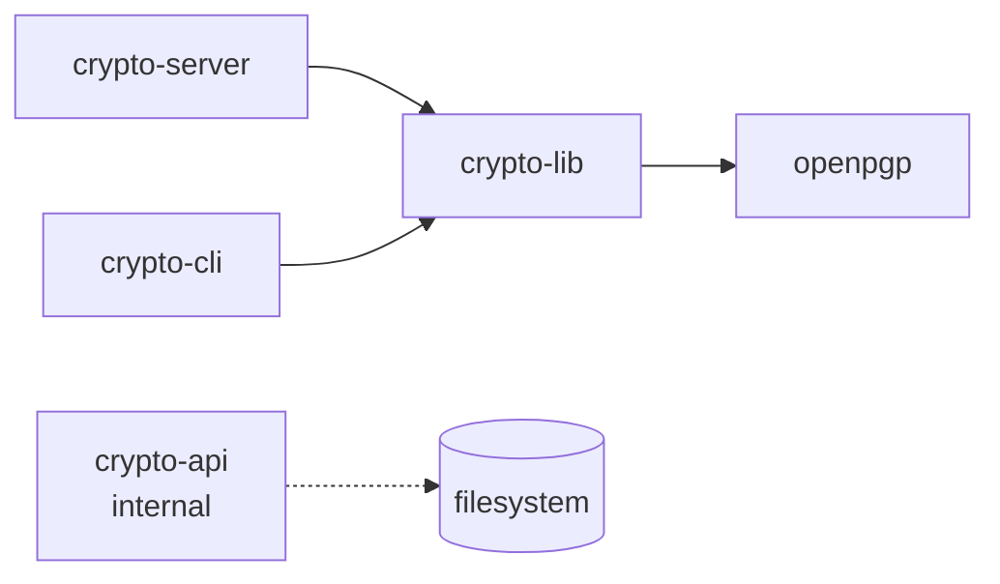

# Crypto Service Suite — Packages

This directory holds the four packages that make up the Crypto Service
Suite. See the root [README](../README.md) for setup, the
[`docs/architecture.md`](../docs/architecture.md) for the bigger picture,
and each package's own README for usage details.

| Package | Role | Published | README |
|---|---|---|---|
| `@sebastienrousseau/crypto-lib`    | Pure async functions over openpgp 5. The trust core of the suite. | ✅ | [crypto-lib/README.md](crypto-lib/README.md) |
| `@sebastienrousseau/crypto-server` | Fastify REST front with JWT, helmet, schema validation, rate-limit. | ✅ | [crypto-server/README.md](crypto-server/README.md) |
| `@sebastienrousseau/crypto-cli`    | Prompts-driven interactive CLI for all eight operations. | ✅ | [crypto-cli/README.md](crypto-cli/README.md) |
| `@sebastienrousseau/crypto-api`    | Internal Postman → Markdown documentation generator. | 🔒 private | [crypto-api/README.md](crypto-api/README.md) |

## Dependency graph

`crypto-cli` and `crypto-server` declare a `workspace:*` dependency on
`crypto-lib` so they always pick up the local source during development.
`crypto-api` is standalone — it has no dependency on the other three
packages.
